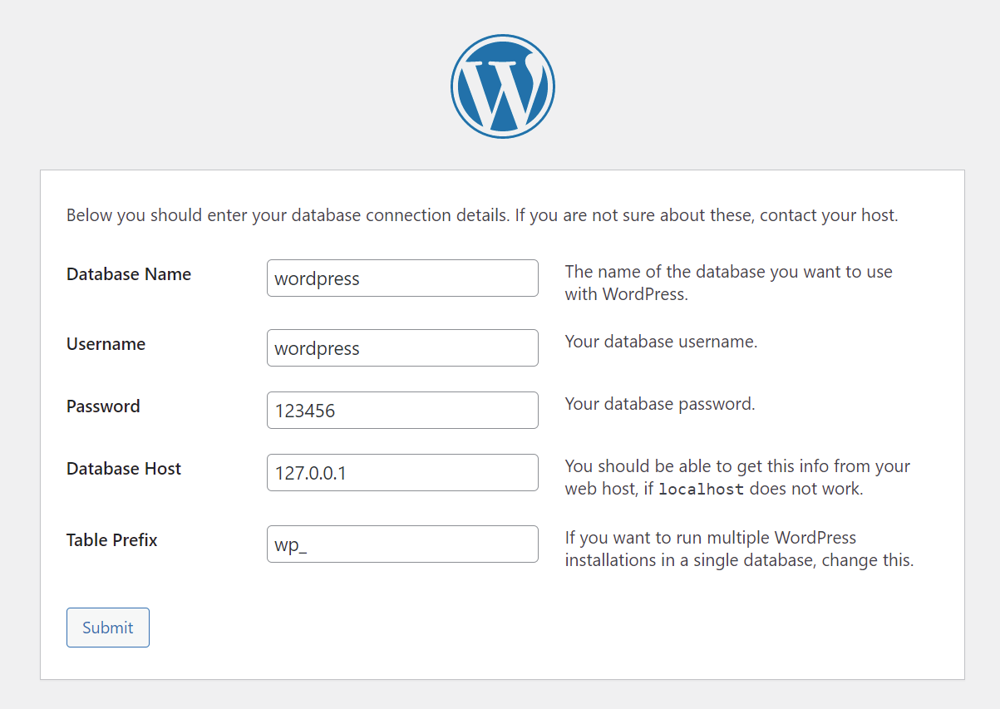

LNMP-wordpress 搭建博客  
  
第一个容器做的小实验，熟悉 Dockerfile 制作镜像和使用容器  
  
# 环境  
- win11 上利用 vmware 创建 ubuntu22.04 虚拟机  
- 虚拟机中创建 nginx+php-fpm 的镜像，暴露端口 80 提供 web 服务  
- 拉取官方仓库的 mysql:5.7 镜像，不对外暴露端口，运行时以 container 模式和 nginx 容器使用一个网络  
- nginx web 服务器的配置文件，日志和 wordpress 的网页文件做持久化，将宿主机的文件目录挂载到容器响响应的目录中  
- mysql 容器的数据和配置文件做持久化处理  
  
主运行脚本在如下目录：  
```bash  
docker/dockerfile/web/nginx  
```  
下面的 run.sh 为运行脚本  
```bash  
[root@docker nginx]$ pwd  
/docker/dockerfile/web/nginx  
[root@docker nginx]$  
[root@docker nginx]$ tree -L 1  
.  
├── add_user.sh  
├── build.sh  
├── data  
├── Dockerfile  
├── entrypoint.sh  
├── get_imgs.sh  
├── init_data.sh  
├── nginx  
├── php8  
├── php82  
├── run_mysql.sh  
├── run.sh  
└── src  
  
5 directories, 8 files  
```  
  
  
# 宿主机建立账号  
- nginx 和 php-fpm 使用的用户和组为 www(124)  
- mysql 中使用的用户和组为 mysql(999)  
- 数据做持久化，会将宿主机中相应的目录挂载到容器目录中，因此在宿主机中建立和容器中 id 相同的账号  
如宿主机用 ubuntu22.04，无 www 用户和组，uid 124 也未被占用，因此创建该用户和组  
```bash  
groupadd -g 124 -r www  
useradd -s /sbin/nologin -u 124 -g 124 -r -M www  
```  
宿主机装上 docker 后，有一个 docker (999) 的组，因此创建一个 mysql (999) 的用户，指定 gid 为 999  
```bash  
useradd -s /sbin/nologin -u 999 -g 999 -r -M mysql  
```  
- 上面创建的 user 和 group 已经写到 Dockerfile 中，而 mysql 是直接用官方的镜像，如果要修改 owner 和 group 需要重新做镜像  
  
- 建账号的脚本为 `docker/dockerfile/web/nginx/add_user.sh`，在 `run.sh` 脚本中执行的第一个脚本，如果账号不满足要求则不能执行脚本  
  
  
# 修改宿主机挂载的文件路径和属性  
在 `docker/dockerfile` 中有初始镜像的数据，创建容器后挂载宿主机的一些目录到容器中存放容器的数据，挂载的目录在 `docker/dockerfile/web/nginx/run.sh` 脚本中指明  
  
初始挂载目录中的文件和 `docker/dockerfile` 中的初始数据相同，启动容器时会将宿主机的，目录挂载，因此容器的对应目录中的内容会被覆盖，容器运行后会生成一些新数据  
  
如果运行一个容器后，想将容器的数据目录还原初始数据，则执行 `docker/dockerfile/web/nginx/init_data.sh` 脚本，该脚本会删除容器的数据，将初始数据拷贝过去并修改属性  
  
# 拉取镜像  
- nginx 镜像做好后上传到阿里云镜像仓库，可以用下面命令拉取  
```bash  
[root@nginx1 shell_scripts]$ docker pull registry.cn-hangzhou.aliyuncs.com/lnmp_wordpress/nginx-alpine:2.14-01  
2.14-01: Pulling from lnmp_wordpress/nginx-alpine  
31e352740f53: Pull complete  
fa898d506f52: Pull complete  
5e0c2d44d085: Pull complete  
03298b2f5ee6: Pull complete  
01b8894003d8: Pull complete  
9e7fe484d7c9: Pull complete  
98c016007037: Pull complete  
4ca8d922b445: Pull complete  
Digest: sha256:4c9a9028fad51d69fe38300530c3b0052099f5aa028144526e93b94fa115a83d  
Status: Downloaded newer image for registry.cn-hangzhou.aliyuncs.com/lnmp_wordpress/nginx-alpine:2.14-01  
registry.cn-hangzhou.aliyuncs.com/lnmp_wordpress/nginx-alpine:2.14-01  
[root@nginx1 shell_scripts]$ docker images  
REPOSITORY                                                      TAG       IMAGE ID       CREATED       SIZE  
registry.cn-hangzhou.aliyuncs.com/lnmp_wordpress/nginx-alpine   2.14-01   ffbecc875ccb   5 hours ago   107MB  
[root@nginx1 shell_scripts]$  
```  
  
- mysql 镜像使用官方镜像，可以直接从官方拉取   
```bash  
[root@nginx1 shell_scripts]$ docker pull mysql:5.7  
```  
  
在运行脚本中会调用同级目录下的 `get_imgs.sh` 来制作需要的两个镜像  
  
  
# 启动容器  
镜像构建的 Dockerfile 以及运行的脚本均在同级 `docker` 目录中  
```bash  
➜  LNMP-wordpress-01 git:(master) ✗ \ls -l  
total 4  
-rwxrwxrwx 1 lx lx 1727 Jun 22 17:45 LNMP-wordpress搭建.md  
drwxrwxrwx 1 lx lx 4096 Jun 22 16:53 docker  
```  
  
运行容器的脚本以及 Dockerfile 在 dockerfile 子目录中  
```bash  
➜  docker git:(master) ✗ ls  
dockerfile  mysql  web  
```  
  
```bash  
➜  docker git:(master) ✗ tree -L 3 dockerfile  
dockerfile  
├── database  
│   └── mysql  
│       ├── conf  
│       ├── data  
│       ├── env.list  
│       ├── run.sh  
│       ├── run_container.sh  
│       └── run_init.sh  
├── system  
│   ├── alpine  
│   │   ├── Dockerfile  
│   │   └── build.sh  
│   ├── centos  
│   ├── debian  
│   └── ubuntu  
└── web  
    ├── apache  
    ├── nginx  
    │   ├── Dockerfile  
    │   ├── build.sh  
    │   ├── data  
    │   ├── entrypoint.sh  
    │   ├── init_data.sh  
    │   ├── nginx  
    │   ├── php8  
    │   ├── php82  
    │   ├── run.sh  
    │   └── src  
    └── tomcat  
```  
  
  
1. 运行 nginx 容器，执行 run.sh   
使用宿主机 80 端口，提前查看确认宿主机的该端口未被占用  
```bash  
#!/bin/bash  
  
IMAGE="nginx-alpine:2.14-01"  
PORT_HOST="80"  
PATH_HOST_PREFIX="/docker/web"  
export NGINX_NAME=${1}  
  
if [ "${1}" == "-h|--help" ]; then  
    echo "Please provide an argument as the name of the container, \  
        or use "nginx-01" as the default container name."  
fi  
  
docker run -d -p ${PORT_HOST}:80 \  
           -v ${PATH_HOST_PREFIX}/nginx/conf:/usr/local/nginx/conf \  
           -v ${PATH_HOST_PREFIX}/nginx/logs:/usr/local/nginx/logs \  
           -v ${PATH_HOST_PREFIX}/php82:/etc/php82  \  
           --name ${NGINX_NAME:=nginx-01} \  
           ${IMAGE}  
```  
  
2. 运行 mysql 容器，以 container 模式运行，则执行 `run_container.sh`  
与 nginx 容器运行脚本在一个终端执行  
```bash  
#!/bin/bash  
  
#PORT_HOST="3306"  
IMAGE="mysql:5.7"  
PATH_HOST_PREFIX="/docker/mysql"  
MYSQL_NAME=${1}  
  
if [ -z "$NGINX_NAME" ]; then  
    echo "please run the nginx container before starting the mysql container"  
elif [ "${1}" == "-h|--help" ]; then  
    echo "Please provide an argument as the name of the container, \  
        or use "mysql-01" as the default container name."  
fi  
  
  
docker run --name ${MYSQL_NAME:=mysql-01} \  
           --network container:${NGINX_NAME} \  
           --env-file ./env.list \  
           -v ${PATH_HOST_PREFIX}/data:/var/lib/mysql \  
           -v ${PATH_HOST_PREFIX}/conf/conf.d:/etc/mysql/conf.d \  
           -v ${PATH_HOST_PREFIX}/conf/mysql.conf.d:/etc/mysql/mysql.conf.d \  
           -d ${IMAGE} --character-set-server=utf8mb4  
```  
  
3. 查看容器的运行状态以及宿主机的端口  
```bash  
[root@docker mysql]$ docker ps  
[root@docker mysql]$ ss -ntl  
```  
  
# 利用 wordpress 搭建博客  
本地浏览器中输入宿主机的 IP 地址，默认会进入 wordpress 的安装界面，填写数据库和用户的信息如下：  
  
  
注意数据库的主机写 `127.0.0.1`，因为 mysql 和 nginx 用相同的 IP，端口号 3306 为默认值可以不用写  
  
# 后续改进  
目前 nginx 和 mysql 都是单点，后续还需做高可用和负载均衡处理   
