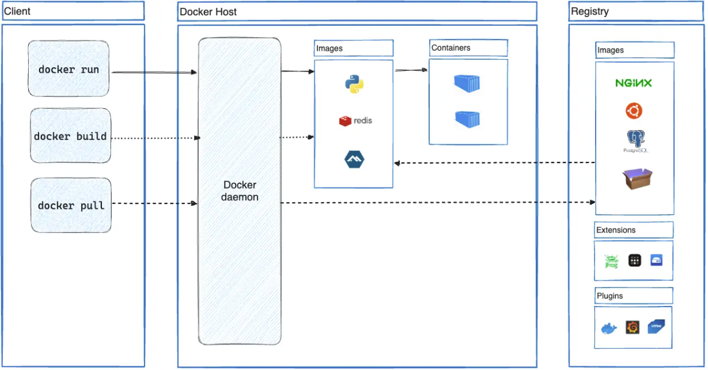

Docker 学习笔记  
    
# 资源  
> Docker 官网介绍：[Docker overview](https://docs.docker.com/get-started/overview/)  
> Docker 客户端命令：[Use the Docker command line](https://docs.docker.com/engine/reference/commandline/cli/)  
> Dockerfile 官网介绍：[Dockerfile reference](https://docs.docker.com/engine/reference/builder/#arg)  
> Docker 容器镜像仓库：[dockerhub](https://hub.docker.com/)  
> [Demystifying Containers](https://github.com/saschagrunert/demystifying-containers/tree/master)  
    
    
# PaaS、IaaS、SaaS 与 CaaS  
> [PaaS、IaaS、SaaS 与 CaaS：它们有何不同？](https://cloud.google.com/learn/paas-vs-iaas-vs-saas?hl=zh-cn)  
    
    
# 容器（Container）  
    
## 容器介绍  
> [什么是容器](https://cloud.google.com/learn/what-are-containers?hl=zh-cn)  
> [Use containers to Build, Share and Run your applications](https://www.docker.com/resources/what-container/)  
    
    
> A container is a standard unit of software that packages up code and all its dependencies so the application runs quickly and reliably from one computing environment to another.  
    
    
- 容器是包含了能在任何环境中运行所需的全部元素的软件包  
- 容器可以虚拟化操作系统，并在任何地方运行  
    
    
## 容器的作用  
> [什么是容器](https://cloud.google.com/learn/what-are-containers?hl=zh-cn)  
    
    
- 可移植性好  
容器几乎能在任何地方运行，减轻了开发和部署工作量  
    
- 应用隔离  
容器会在操作系统级别虚拟化 CPU、内存、存储和网络资源,  
为开发者提供在逻辑上与其他应用相隔离的操作系统接口  
    
    
## 容器和虚拟机  
> [什么是容器](https://cloud.google.com/learn/what-are-containers?hl=zh-cn)  
> [Containers vs. virtual machines](https://www.atlassian.com/microservices/cloud-computing/containers-vs-vms)  
> [Containers vs. Virtual Machines (VMs): What’s the Difference?](https://www.ibm.com/cloud/blog/containers-vs-vms)  
    
    
> The key differentiator between containers and virtual machines is that virtual machines virtualize an entire machine down to the hardware layers and containers only virtualize software layers above the operating system level  
    
    
- 容器比虚拟机更轻量化  
容器在操作系统级别虚拟化，虚拟机在硬件级别进行虚拟化  
容器共享操作系统内核，占用的内存比虚拟机更小  
容器启动比虚拟机更快，消耗的资源更少  
    
- 容器的隔离性没有虚拟机好  
一个宿主机上的所有容器共享硬件系统  
    
    
## 容器管理工具  
- LXC  
- docker  
- pouch  
- [podman](https://podman.io/)  
    
## 容器规范  
> [Open Container Initiative](https://opencontainers.org/)  
    
The OCI currently contains three specifications: the Runtime Specification (runtime-spec), the Image Specification (image-spec) and the Distribution Specification (distribution-spec).  
    
## Container Runtime  
> [What are container runtimes?](https://opensource.com/article/21/9/container-runtimes)  
> [Most Popular Container Runtimes](https://www.cloudraft.io/blog/container-runtimes)  
    
容器运行时（Container Runtime）是一种负责在操作系统上创建、运行和管理容器的软件组件。它提供了容器的生命周期管理、文件系统隔离、网络配置和资源管理等功能，使得容器能够在操作系统上以独立的方式运行。  
    
容器运行时有两个级别：  
- low-level container runtime  
Container runtimes focus more on running containers, setting up namespace and cgroups for containers, and are also called lower-level container runtimes.  
    
接近内核层，例如 runc 是 docker 使用的 low-level runtime  
- high-level container runtime  
Higher-level container runtimes or container engines focus on formats, unpacking, management, and image-sharing. They also provide APIs for developers.  
    
接近用户层，如 docker engine，k8s 中使用的 cri-o  
    
# Docker 介绍  
> [Docker Overview](https://docs.docker.com/get-started/overview/)  
    
Docker is an open platform for developing, shipping, and running applications. Docker enables you to separate your applications from your infrastructure so you can deliver software quickly.  
    
容器的前端管理工具  
    
- KVM 和 Docker  
KVM 单机管理虚拟机  
Openstack 管理多主机上全部的虚拟机  
    
docker 单机管理容器  
docker compose：单个主机容器编排工具，类似 makefile, ansible 的 playbook  
kurbernets 管理多主机上全部容器  
    
Docker 隔离性没有 KVM 上装多个虚拟机隔离性好  
    
- docker 缺点  
宿主机多个容器共享内核，隔离性不如虚拟机  
容器和宿主机的进程隔离，进入容器中调试容器内的进程等很繁琐  
如果要进入容器中调试，则需要在每个容器中安装相应工具，浪费存储空间  
    
# Docker 架构  
> [Docker Overview](https://docs.docker.com/get-started/overview/)  
    
    
- C/S 架构  
- The Docker client and daemon communicate using a REST API, over UNIX sockets or a network interface.  
    
  
    
    
## Docker deamon  
The Docker daemon (dockerd) listens for Docker API requests and manages Docker objects such as images, containers, networks, and volumes. A daemon can also communicate with other daemons to manage Docker services.  
    
## Docker client  
The Docker client (docker) is the primary way that many Docker users interact with Docker. When you use commands such as docker run, the client sends these commands to dockerd, which carries them out. The docker command uses the Docker API. The Docker client can communicate with more than one daemon.  
    
## Docker registries  
> Docker 容器镜像仓库：[dockerhub](https://hub.docker.com/)  
    
A Docker registry stores Docker images. Docker Hub is a public registry that anyone can use, and Docker looks for images on Docker Hub by default. You can even run your own private registry.  
    
When you use the docker pull or docker run commands, Docker pulls the required images from your configured registry. When you use the docker push command, Docker pushes your image to your configured registry.  
    
- docker 镜像仓库，默认为官方的镜像仓库，也可以配置自己的私有仓库  
    
## Docker objects  
    
### Images 镜像  
> [Images and layers](https://docs.docker.com/storage/storagedriver/#images-and-layers)  
> [Docker - Behind the Scenes](https://accenture.github.io/blog/2021/03/10/docker-behind-the-scenes.html)  
> [Docker Images and How to work with them ](https://medium.com/@dsametriya/docker-images-and-how-to-work-with-them-db7aac383479)  
    
    
An image is a read-only template with instructions for creating a Docker container.  
    
创建 Docker 容器的只读模板，可以从官方或第三方仓库拉取镜像，或者自己制作镜像  
    
镜像是静态文件，占磁盘  
    
To build your own image, you create a Dockerfile with a simple syntax for defining the steps needed to create the image and run it.  
    
Each instruction in a Dockerfile creates a layer in the image. When you change the Dockerfile and rebuild the image, only those layers which have changed are rebuilt.  
This is part of what makes images so lightweight, small, and fast, when compared to other virtualization technologies.  
    
镜像是分层的，镜像的底层为只读的库文件，启动为容器后会生成一个可写层，写入的数据会赋值到宿主机中对于的目录，默认容器删除后该目录的内容也删除  
    
    
常用 alpine 作为基础镜像以减小体积  
另一个 busybox 也可以做基础，但太小，没有 alpine 适合  
    
#### UnionFS  
> [Docker - Behind the Scenes](https://accenture.github.io/blog/2021/03/10/docker-behind-the-scenes.html)  
> [HOW DOCKER IMAGES WORK: UNION FILE SYSTEMS FOR DUMMIES](https://www.terriblecode.com/blog/how-docker-images-work-union-file-systems-for-dummies/)  
    
    
> The union file system (UnionFS) enables storage efficiency for Docker images and containers.  
    
> Docker uses UnionFS with a copy-on-write strategy. When changes get applied to a Docker image, it creates a new layer on top that does not affect layers below. This enables Docker to propagate changes efficiently, as only layer updates need to be distributed.  
    
在 Docker 中使用的 UnionFS（联合文件系统）是一种文件系统技术，它允许将多个不同的文件系统层级以可写的方式联合在一起，形成一个单一的虚拟文件系统。UnionFS 是 Docker 实现镜像分层和容器轻量级的关键技术之一。  
    
    
#### dangling image  
A Docker dangling image refers to an image that has been untagged and is not in use by any running containers or other images. In other words, a dangling image is an image that has no name and no tag, and it's not being used by any containers or other images.  
    
Dangling images can be created when a new version of an image is built, and the previous version of the image is no longer needed. If an image is removed or deleted with the `docker rmi` command, any associated containers must first be removed before the associated image can be deleted. If one or more containers that are based on a particular image are still running, then the image will not be removed and instead will be marked as a dangling image.  
    
Docker automatically removes dangling images when the `docker system prune` command is run. This command removes stopped containers, unused networks, and dangling images, freeing up disk space on the host system.  
    
Note that dangling images can also occur when a build context is used to create new images. If a file is removed or renamed in the build context, the previous docker layers that used that file will become unused and may be removed as a result. This can lead to additional dangling images on the host system.  
    
    
docker system prune 清理不用的容器、镜像等  
    
### Containers 容器  
> [Demystifying Containers](https://github.com/saschagrunert/demystifying-containers/tree/master)  
    
A container is a runnable instance of an image. You can create, start, stop, move, or delete a container using the Docker API or CLI. You can connect a container to one or more networks, attach storage to it, or even create a new image based on its current state.  
    
容器是镜像的运行的实例，可以对容器进行创建、启动、删除等操作，可以修改容器后基于当前状态创建镜像  
    
容器是进程，占磁盘和内存  
    
默认一个宿主机上的多个容器是相互隔离的  
You can control how isolated a container's network, storage, or other underlying subsystems are from other containers or from the host machine.  
    
一个 Docker 主进程内各个容器都是其子进程，各子进程需要隔离  
    
#### Linux Namespace 名称空间  
> [Linux Namespaces](https://github.com/saschagrunert/demystifying-containers/blob/master/part1-kernel-space/post.md#linux-namespaces)  
> [Linux namespaces](https://en.wikipedia.org/wiki/Linux_namespaces)  
    
- 内核功能  
- The idea behind a namespace is to wrap certain global system resources in an abstraction layer.  
- 不同名称空间的进程相互隔离  
- `lsns` 查看 linux 名称空间  
    
名称空间的类型：  
- Mount (mnt)  
挂载点和文件系统的隔离  
- Unix Time-sharing System (uts)  
UTS (UNIX Time-Sharing) namespaces allow a single system to appear to have different host and domain names to different processes.  
    
允许和系统不同的主机和域名  
- Interprocess Communication (ipc)  
IPC namespaces isolate processes from SysV style inter-process communication. This prevents processes in different IPC namespaces from using, for example, the SHM family of functions to establish a range of shared memory between the two processes.  
    
进程通信的隔离，包括信号量、消息队列和共享内存  
- Porcess ID (pid)  
The PID namespace provides processes with an independent set of process IDs (PIDs) from other namespaces.  
This means that processes which reside in different namespaces can own the same PID.  
- Network (net)  
Network namespaces virtualize the network stack. On creation, a network namespace contains only a loopback interface.  
    
Each network namespace contains its own resource properties within /proc/net.  
    
Each namespace will have a private set of IP addresses, its own routing table, socket listing, connection tracking table, firewall, and other network-related resources.  
- User ID (user)  
User namespaces are a feature to provide both privilege isolation and user identification segregation across multiple sets of processes available since kernel 3.8.  
    
A user namespace contains a mapping table converting user IDs from the container's point of view to the system's point of view.  
例如容器中的 root 用户 id 为 0，但其在宿主机中的 id 可能为 1800  
- Control Group (cgroup)  
The main goal of cgroups is to support resource limiting, prioritization, accounting and controlling.  
    
进程的资源限制  
- Timing  
The time namespace allows processes to see different system times in a way similar to the UTS namespace.  
    
    
# Docker 存储引擎 overlay2  
> [About storage drivers](https://docs.docker.com/storage/storagedriver/)  
> [Docker storage drivers](https://docs.docker.com/storage/storagedriver/select-storage-driver/)  
> [Configure Docker with the overlay2 storage driver](https://docs.docker.com/storage/storagedriver/overlayfs-driver/)  
    
    
Docker uses storage drivers to store image layers, and to store data in the writable layer of a container.  
    
Each layer is only a set of differences from the layer before it. Note that both adding, and removing files will result in a new layer.  
    
The layers are stacked on top of each other. When you create a new container, you add a new writable layer on top of the underlying layers. This layer is often called the "container layer". All changes made to the running container, such as writing new files, modifying existing files, and deleting files, are written to this thin writable container layer.  
    
镜像是分层的，见 [About storage drivers](https://docs.docker.com/storage/storagedriver/) 中的示例讲解  
    
    
overlay2 存储引擎 各层叠加  
容器 run 原始镜像复制，stop 时将原来镜像部分删除，保留该容器的新数据，下次 start 后再将镜像复制  
    
Docker Overlay2 is a storage driver used in Docker to manage the container's file system. It allows multiple Docker containers to share the same base image and reduces the disk space used by each container as layers that differ from the base image are stored efficiently.  
    
Overlay2 uses two directories on the host system for Docker storage, the lower directory for read-only files originating from the image and an upper directory for the read-write files specific to the container. Changes made to the container are written to the upper directory, which transparently overlays the read-only image stored in the lower directory.  
    
Overlay2 also uses a file system delta-compression technique known as "deduplication" to limit the disk space usage. This technique identifies files with identical content across layers and stores them only once. This reduces the size of the container images and improves the performance by reducing I/O operations.  
    
# Docker 安装  
> [Install Docker Engine](https://docs.docker.com/engine/install/)  
> [Linux post-installation steps for Docker Engine](https://docs.docker.com/engine/install/linux-postinstall/#your-kernel-does-not-support-cgroup-swap-limit-capabilities)  
> [阿里云镜像](https://developer.aliyun.com/mirror/docker-ce?spm=a2c6h.13651102.0.0.57e31b11nSQP6A)  
    
    
注意各组件版本一致问题  
docker 客户端可以在另一台主机上，管理本机 docker  
    
按照官方文档步骤包安装，其中 docker 仓库的地址可以该为镜像仓库地址，即 /etc/apt/sources.list.d/docker.list 中的地址 `https://download.docker.com/linux/ubuntu` 改为 `https://mirrors.tuna.tsinghua.edu.cn/docker-ce/linux/ubuntu/`  
    
    
# Docker 优化  
如果官方下载慢，可以用镜像网址代替官网  
    
如果客户端和服务端不在一个主机，docker 服务端和客户端通信改为端口通信，默认本地套接字通信  
    
docker 不建议使用交换空间 swap  
禁用 swap 空间：/etc/fstab 注释交换空间的行，然后命令 swapoff 禁用  
    
私有仓库加入 insecure-registry  
    
Docker Root Dir: /var/lib/docker dockers 全部镜像和数据的默认目录，最好用高速磁盘存放  
可以修改默认目录，运行容器过程中修改目录，则需要先停止 docker  
    
同时上传下载限制  
    
限制日志文件的大小，日志默认在 /var/lib/docker 目录中  
    
# Docker 配置  
> [Docker daemon configuration overview](https://docs.docker.com/config/daemon/)  
> 配置示例：[Daemon configuration file](https://docs.docker.com/engine/reference/commandline/dockerd/#daemon-configuration-file)  
> docker 配置代理：[https://docs.docker.com/network/proxy/](https://docs.docker.com/network/proxy/)  
> [Proxy configuration](https://docs.docker.com/engine/reference/commandline/dockerd/#proxy-configuration)  
    
    
- 配置文件位置：`/etc/docker/daemon.json`  
    
```bash  
{  
  "proxies": {  
    "http-proxy": "http://192.168.0.119:7890",  
    "https-proxy": "http://192.168.0.119:7890",  
    "no-proxy": "localhost,127.0.0.0/8,registry.cn-hangzhou.aliyuncs.com*"  
  },  
  "registry-mirrors": [  
    "https://registry.docker-cn.com",  
    "http://hub-mirror.c.163.com",  
    "https://docker.mirrors.ustc.edu.cn",  
    "https://si7y70hh.mirror.aliyuncs.com/"  
  ],  
  "insecure-registries": ["registry.cn-hangzhou.aliyuncs.com"],  
  "max-concurrent-downloads": 10,  
  "max-concurrent-uploads": 5,  
  "log-opts": {  
    "cache-disabled": "false",  
    "cache-max-file": "5",  
    "cache-max-size": "20m",  
    "cache-compress": "true",  
    "env": "os,customer",  
    "labels": "somelabel",  
    "max-file": "5",  
    "max-size": "100m"  
  },  
  "dns": ["10.0.0.200", "10.0.0.201"],  
  "live-restore": true  
}  
```  
    
- live-restore: true docker 服务器重启后原来正在运行的容器不受影响  
- insecure-registry: 设置自定义的镜像仓库地址，允许该仓库使用不安全的传输协议，如 http，默认 docker 客户端只允许连接和拉取使用安全传输协议的镜像仓库  
- registry-mirrors: 使用镜像仓库拉取镜像，更快下载  
如果配置代理，可以不配置镜像网址，或者将镜像网址加入 no_proxy  
    
修改配置后时其生效：  
```bash  
[root@docker ~]$ systemctl daemon-reload; systemctl restart docker.service  
```  
    
# 容器内部 hosts 文件  
容器会自动将容器ID 加入容器内 /etc/hosts 文件中解析为其 IP 地址  
    
# Docker 客户端命令  
> [Use the Docker command line](https://docs.docker.com/engine/reference/commandline/cli/)  
    
## docker version 查看版本  
    
## docker info 查看详细信息  
镜像数，容器数等详细信息  
    
## docker search 搜索镜像  
```bash  
docker search --filter=is-automated=true --filter=stars=1 fedora  
```  
    
## docker inspect 查看详细信息  
> [docker inspect](https://docs.docker.com/engine/reference/commandline/inspect/)  
    
Docker inspect provides detailed information on constructs controlled by Docker.  
    
默认返回结果是 json 格式  
    
可以查看容器、镜像、网络等详细信息  
> --type container|image|node|network|secret|service|volume|task|plugin  
    
```bash  
docker inspect --type=volume myvolume  
```  
    
## docker system prune 清除不用的数据  
> [docker system prune](https://docs.docker.com/engine/reference/commandline/system_prune/)  
    
Remove all unused containers, networks, images (both dangling and unreferenced), and optionally, volumes.  
    
    
## docker image 镜像操作相关命令  
有些可以省略 `image` 子命令，如 `docker pull`，其和 `docker image pull` 相同  
    
`docker image -h` 查看子命令  
    
### docker pull 拉取镜像  
> [docker pull](https://docs.docker.com/engine/reference/commandline/pull/)  
    
- 如从 docker hub 拉取 ubuntu 镜像，先找到 ubuntu 镜像仓库：[ubuntu](https://hub.docker.com/_/ubuntu)  
仓库中提供了支持的 tags  
    
- 用 docker pull 拉取镜像时指明镜像的 tag  
```bash  
[root@docker dockerfile]$ docker pull ubuntu:22.04  
22.04: Pulling from library/ubuntu  
aee1767db0dd: Pull complete  
Digest: sha256:f154feaf13b51d16e2b4b5575d69abc808da40c4b80e3a5055aaa4bcc5099d5b  
Status: Downloaded newer image for ubuntu:22.04  
docker.io/library/ubuntu:22.04  
```  
    
默认镜像保存路径为：/var/lib/docker/overlay2/镜像ID  
    
### docker images 查看本地镜像  
> [docker images](https://docs.docker.com/engine/reference/commandline/images/)  
    
查看帮助 `docker images -h`  
    
#### docker images -q 仅显示镜像 ID  
```bash  
[root@docker ~]$ docker images hello-world -q  
9c7a54a9a43c  
```  
    
#### 设置显示格式  
```bash  
[root@docker ~]$ docker image ls --format "{{.Repository}}:{{.Tag}}"  
nginx-alpine:2.14-v2  
redis-alpine:7.0.11-v1  
alpine-base:3.18-v1  
haproxy:2.8.0-alpine3.18  
redis:7.0-alpine  
ubuntu22.04-base:v1  
hello-world:latest  
mysql:5.7  
```  
    
#### 查看 untagged 镜像  
```bash  
docker images -f "dangling=true"  
```  
    
### docker inspect 查看镜像详细信息  
    
### docker history 查看镜像创建历史  
    
    
### docker save 导出镜像  
> [docker save](https://docs.docker.com/engine/reference/commandline/save/)  
    
将本地镜像导出为一个 tar 文件，方便后续赋值到其他宿主机使用  
可以导出多个镜像  
    
```bash  
docker save -o fedora-latest.tar fedora:latest  
docker save myimage:latest | gzip > myimage_latest.tar.gz  
docker save -o ubuntu.tar ubuntu:lucid ubuntu:saucy  
```  
    
### docker load 导入镜像  
```bash  
docker load -i fedora.tar  
```  
    
### docker image rm 删除本地镜像  
或者用 `docker rmi`  
    
如果要删除正在使用的镜像，则用 `docker image rm -f`  
    
    
### docker image prune 删除不使用的镜像  
> [docker image prune](https://docs.docker.com/engine/reference/commandline/image_prune/)  
    
Remove all dangling images. If -a is specified, will also remove all images not referenced by any container.  
    
### docker tag 给镜像打标签  
> [docker tag](https://docs.docker.com/engine/reference/commandline/tag/)  
    
```bash  
docker tag httpd:test fedora/httpd:version1.0.test  
```  
    
## docker container 容器管理相关命令  
很多命令可以省略 `container`，如 `docker container run`，也可以直接使用 `docker run`  
    
### docker ps 显示容器信息  
- 默认进显示正在运行的容器  
- 和 `docker container ls` 相同  
    
#### docker ps -a 显示全部容器  
    
#### docker ps -q 仅显示容器ID  
    
#### docker ps -s 显示容器大小  
    
#### docker ps -l 显示最新创建的容器  
- `--latest`  
    
#### docker ps -f 过滤输出  
```bash  
docker ps -f 'status=exited'  
```  
    
### docker run 运行容器  
如果要容器运行不退出，需要执行前台命令  
    
如 alpine 这种操作系统镜像，默认运行执行的命令为 /sbin/sh，执行完就退出  
而 nginx 镜像会执行一个持续运行的前台命令，持续运行，提供服务  
    
在容器内退出并停止容器：exit  
在容器内退出但不停止容器：ctrl+p+q  
    
#### docker run -it 交互执行  
    
    
####  docker run --name 指定容器名字  
    
    
#### docker run -hostname 指定容器主机名  
    
#### docker run --rm 退出后删除容器  
    
#### docker run -d 容器后台执行  
`--detach`，容器进程在宿主机的后台运行，与终端无关  
    
#### docker run --restart 指定容器启动的策略  
> [docker run --restart](https://docs.docker.com/engine/reference/commandline/run/#restart)  
    
A restart policy controls whether the Docker daemon restarts a container after exit.  
    
- no  
默认  
Do not automatically restart the container when it exits.  
- on-failure[:max-retries]  
Restart only if the container exits with a non-zero exit status. Optionally, limit the number of restart retries the Docker daemon attempts.  
    
容器异常退出才重启  
- unless-stopped  
Restart the container unless it's explicitly stopped or Docker itself is stopped or restarted.  
- always  
Always restart the container regardless of the exit status. When you specify always, the Docker daemon tries to restart the container indefinitely. The container always starts on daemon startup, regardless of the current state of the container.  
    
    
```bash  
docker run --restart=always redis  
```  
    
#### docker run -P|-p 暴露容器端口  
> --publish	-p		Publish a container's port(s) to the host  
> --publish-all	-P		Publish all exposed ports to random ports  
    
容器中的网络采用 NAT 模式  
如果容器中运行 nginx web 服务，外部用户无法访问容器中的服务器，容器中服务器与外部通信时其 IP 通过 SNAT 转换为其宿主机的 IP  
    
如果需要外部访问容器中的 nginx web 服务，可以做 DNAT 端口映射，客户端访问宿主机的某个端口，如 80 端口时转到容器中 nginx 服务器的 80 端口  
    
- docker run -P  
暴露容器中的全部端口到客户端随机端口  
端口由镜像制作时确定  
    
    
- docker run -p  
可以指定端口映射  
    
```bash  
docker run -p 127.0.0.1:80:8080/tcp ubuntu bash  
```  
曝露容器的 8080 到宿主机换回网卡的TCP 80 端口  
    
- 修改已经创建的容器的端口映射关系  
    
    
#### docker run -e 创建环境变量  
> [docker run -e](https://docs.docker.com/engine/reference/commandline/run/#env)  
    
    
```bash  
docker run --env VAR1=value1 --env VAR2=value2 ubuntu env | grep VAR  
```  
    
可以 `--env-file` 指定环境变量文件  
```bash  
cat env.list  
# This is a comment  
VAR1=value1  
VAR2=value2  
USER=jonzeolla  
    
docker run --env-file env.list ubuntu env | grep -E 'VAR|USER'  
VAR1=value1  
VAR2=value2  
USER=jonzeolla  
```  
    
#### docker run --dns 指定容器 DNS  
默认容器用宿主机的 DNS 地址  
    
```bash  
docker run -it --rm --dns 1.1.1.1 --dns 8.8.8.8 ubuntu bash  
```  
    
或者在配置文件 /etc/docker/daemon.json 中配置  
    
### 容器的启动和停止  
> docker start|stop|restart|pause|unpause  
    
### docker kill 给容器发信号  
默认发送 SIGKILL 信号  
```bash  
docker kill my_container  
```  
    
```bash  
docker kill --signal=SIGHUP my_container  
docker kill --signal=HUP my_container  
docker kill --signal=1 my_container  
```  
    
### docker attach 连接运行的容器  
Attach local standard input, output, and error streams to a running container.  
    
This allows you to view its ongoing output or to control it interactively, as though the commands were running directly in your terminal.  
    
用 exit 后容器会退出  
    
### docker exec 执行容器命令  
    
- 一般指定 shell 类型  
    
进入容器，指定所用终端 shell 为 bash  
```bash  
docker exec -it mycontainer bash  
```  
    
- 进入后可以执行 exit 退出容器，通过 docker ps -a 查看容器已经处于退出状态，可以再用 docker start 启动容器  
    
### docker port 查看容器端口映射关系  
    
    
### docker rm 删除容器  
    
```bash  
Options:  
  -f, --force     Force the removal of a running  
                  container (uses SIGKILL)  
  -l, --link      Remove the specified link  
  -v, --volumes   Remove anonymous volumes associated with the container  
```  
    
删除运行中的容器  
```bash  
docker rm -f redis  
```  
    
删除全部容器  
```bash  
docker rm -f $(docker ps -a -q)  
#或  
docker ps -a -q | xargs docker rm -f  
```  
    
删除已退出的容器  
```bash  
docker rm `docker ps -qf status=exited`  
```  
    
删除运行中的容器  
```bash  
docker rm `docker ps -qf status=running`  
```  
    
删除全部容器  
```bash  
docker container prune -f  
```  
    
### docker top 查看容器内进程  
不进入容器查看容器内进程，显示的 PID 为容器在宿主机中的 PID  
    
如果进入容器中查看进程，PID 为容器中独立的 PID  
     
### docker stats 查看容器资源使用情况  
    
### docker logs 查看容器的日志  
> [docker logs](https://docs.docker.com/engine/reference/commandline/logs/)  
    
查看容器中运行的进程在控制台输出的日志信息，日志在 /var/lib/docker/container 目录下  
    
容器中前台执行标准输出的内容可以用该方式查看  
    
### 容器启动时执行命令  
```bash  
docker run -d alpine tail -f /etc/hosts  
```  
    
### docker cp 容器和宿主机之前复制文件  
> [docker cp](https://docs.docker.com/engine/reference/commandline/cp/)  
    
- 指定容器名可以用容器的 ID（可以不写全，但写出的部分能唯一定位容器）或 NAMES  
- 容器是否正在运行都能复制  
    
#### 将容器的一个目录拷贝到宿主机的目录中  
```bash  
Usage:  docker cp [OPTIONS] CONTAINER:SRC_PATH DEST_PATH|-  
        docker cp [OPTIONS] SRC_PATH|- CONTAINER:DEST_PATH  
```  
    
- 如果不想拷贝容器目录只拷贝目录中的文件，则目录最后加 /.  
```bash  
[root@docker nginx]$ docker cp nginx-02:/data/www/. data/ -a  
```  
- 拷贝目录本身以及目录中的文件  
```bash  
[root@docker nginx]$ docker cp nginx-02:/data/www/ data/ -a  
```  
    
## docker volume 卷操作命令  
### docker volume create 创建卷  
    
### docker volume ls 查看数据卷  
    
### docker volume prune 删除全部不再使用的卷  
    
# 创建镜像  
镜像中无内核，镜像被启动为容器后直接使用宿主机的内核，镜像提供相应的rootfs，即系统正常运行所必须的用户空间的文件系统，如 /dev, /proc, /bin, /etc 等目录，但容器中 /boot 目录为空，该目录保存于内核相关的文件  
    
镜像启动为容器后，如果要持续运行，容器中必须运行前台进程，如果后台运行则容器会退出  
    
    
镜像制作可以手动基于容器制作，也可以基于 dockerfile 制作  
    
## docker commit 基于容器创建镜像  
- `man docker-commit` 查看帮助  
    
制作镜像和容器的状态无关，停止状态也可以制作镜像  
    
    
## docker build 基于 DockerFile 创建镜像  
> [docker build](https://docs.docker.com/engine/reference/commandline/build/)  
    
DockerFile 是被 Docker 程序解释执行的脚本，每条命令独立运行，并会导致创建新镜像  
    
    
将构建的命令写道一个脚本中，如 `build.sh`，脚本和 Dockerfile 在一个目录  
```bash  
#!/bin/bash  
    
#docker build --no-cache -t nginx-alpine:3.15-01 .  
docker build  -t nginx-alpine:3.15-02 -f Dockerfile1 .  
```  
    
`-t` 为镜像指定标签  
`-f` 指定 Docerfile 的文件名，不写则默认为 `Dockerfile`  
最后写上文件路径，`.` 表示当前目录  
    
### Dockerfile 文件格式  
> [Dockerfile reference](https://docs.docker.com/engine/reference/builder/)  
    
    
- 如果环境变量后面多个值，可以通过 `\` 换行添加，但最后一行不能加 `\`；如果最后一行加上 `\`，会影响下面一行的执行  
    
- 使用 `ARG` 时，如果后面的值使用了前面的值，则不能写在一个 `ARG` 中，如：  
```bash  
ARG NGINX_VERSION="1.24.0" \  
    NGINX_FILE="nginx-${NGINX_VERSION}.tar.gz" \  
    PATH_TMP="/tmp/src"  
```  
上面的写法第二个变量不能正确赋值，应改为如下写法：  
```bash  
ARG NGINX_VERSION="1.24.0"  
ARG NGINX_FILE="nginx-${NGINX_VERSION}.tar.gz" \  
    PATH_TMP="/tmp/src"  
    
ADD src/${NGINX_FILE} ${PATH_TMP}/  
```  
    
- 能合并到一个指令中写时尽量在一个指令中，增加一个指令会增加一层镜像  
- `#`开头注释  
- Docker 将尽可能重用中间镜像层的缓存以加速 docker build 命令的执行过程  
制作一个镜像可能会执行多次，反复修改，每次执行都是按照顺序执行，已经执行过的命令会被缓存，下次执行 dockerfile 时会从第一条修改或或新的命令开始往后执行，因此制作镜像时最好将不会变化的内容放在前面以充分利用缓存加速镜像制作  
    
### FROM 指定基础镜像  
> [FROM](https://docs.docker.com/engine/reference/builder/#from)  
    
The FROM instruction initializes a new build stage and sets the Base Image for subsequent instructions. As such, a valid Dockerfile must start with a FROM instruction.  
    
必须为第一个执行的命令，该行上面可以有注释行或 `ARG` 行指定参数  
    
```bash  
ARG  CODE_VERSION=latest  
FROM base:${CODE_VERSION}  
CMD  /code/run-app  
    
FROM extras:${CODE_VERSION}  
CMD  /code/run-extras  
```  
    
### LABEL 指定镜像元数据  
> [LABEL](https://docs.docker.com/engine/reference/builder/#label)  
    
The LABEL instruction adds metadata to an image. A LABEL is a key-value pair. To include spaces within a LABEL value, use quotes and backslashes as you would in command-line parsing.  
    
```bash  
LABEL multi.label1="value1" \  
      multi.label2="value2" \  
      other="value3"  
LABEL description="This text illustrates \  
that label-values can span multiple lines."  
```  
    
### COPY 复制文本  
> [COPY](https://docs.docker.com/engine/reference/builder/#copy)  
    
> COPY [--chown=<user>:<group>] [--chmod=<perms>] <src>... <dest>  
> COPY [--chown=<user>:<group>] [--chmod=<perms>] ["<src>",... "<dest>"]  
    
- 将宿主机的文件拷贝到容器中，源为宿主机，目的地址为容器中目录  
- 宿主机如果为目录，则默认将目录中的文件内容全部拷贝，包括子目录，不拷贝目录本身  
- 容器的目录如果不存在，则全部不存在的目录可以自动新建  
- 宿主机的文件默认当前目录为 Dockerfile 所在的目录，如果要拷贝的文件在当前目录的上级，可以写相对路径  
- 宿主机的路径只能写相对路径，写绝对路径会报错  
- 如果要修改属性和权限，位置应在最前面，顺序不能错  
```bash  
COPY ../install.sh /root/  
```  
如果源文件写宿主机中绝对路径，报错：  
```bash  
COPY /etc/test.txt /root/  
```  
- COPY 拷贝目录时格式，如下面两种写法有区别，用第二种才能正确拷贝目录中全部文件  
```bash  
COPY php8/* /root/php8/  
COPY php8/ /root/php8-1/  
```  
Dockerfile 当前目录有一个 php8 的文件夹，其内容入下：  
```bash  
[root@docker nginx]$ ls  
build.sh  Dockerfile  php8  src  
[root@docker nginx]$ tree php8  
php8  
├── conf.d  
├── php-fpm.conf  
├── php-fpm.d  
│   └── www.conf  
└── php.ini  
    
2 directories, 3 files  
```  
    
生成镜像后查看，第一种 `php8/*` 的写法，拷贝的没有子目录  
```bash  
[root@docker nginx]$ docker run -it --name test2 nginx-alpine:3.15-02 bash  
bash-5.1# cd /root  
bash-5.1# ls  
b.sh    php8    php8-1  
bash-5.1# ls -l php8  
total 104  
-rw-r--r--    1 root     root          5329 Oct 26  2022 php-fpm.conf  
-rw-r--r--    1 root     root         72548 Jun 15 19:59 php.ini  
-rw-r--r--    1 root     root         20547 Jun 15 19:56 www.conf  
bash-5.1#  
bash-5.1# ls -l php8-1/  
total 88  
drwxr-xr-x    2 root     root          4096 Jun 15 18:46 conf.d  
-rw-r--r--    1 root     root          5329 Oct 26  2022 php-fpm.conf  
drwxr-xr-x    2 root     root          4096 Jun 17 16:40 php-fpm.d  
-rw-r--r--    1 root     root         72548 Jun 15 19:59 php.ini  
bash-5.1#  
```  
    
- 拷贝文件时，可以使用 chown 和 chmod 修改属性，会将文件夹中全部的文件修改  
```bash  
RUN addgroup -g 201 -S www \  
    && adduser -s /sbin/nologin -S -D -H -u 201 -G www www  
    
COPY ../install.sh /root/b.sh  
COPY php8/* /root/php8/  
COPY php8/ /root/php8-1/  
COPY --chown=www:www --chmod=777 php8/ /root/php/php8-1  
```  
    
进入容器中查看：  
```bash  
[root@docker nginx]$ docker run -it --name test nginx-alpine:3.15-02 bash  
bash-5.1# cd /root/  
bash-5.1# ls  
b.sh  php   php8  
bash-5.1# ls -lR php  
php:  
total 4  
drwxr-xr-x    4 www      www           4096 Jun 17 16:40 php8-1  
    
php/php8-1:  
total 88  
drwxrwxrwx    2 www      www           4096 Jun 15 18:46 conf.d  
-rwxrwxrwx    1 www      www           5329 Oct 26  2022 php-fpm.conf  
drwxrwxrwx    2 www      www           4096 Jun 17 16:40 php-fpm.d  
-rwxrwxrwx    1 www      www          72548 Jun 15 19:59 php.ini  
    
php/php8-1/conf.d:  
total 0  
    
php/php8-1/php-fpm.d:  
total 24  
-rwxrwxrwx    1 www      www          20547 Jun 15 19:56 www.conf  
bash-5.1# exit  
exit  
```  
    
    
### ADD 复制和解包  
> [ADD](https://docs.docker.com/engine/reference/builder/#add)  
    
- 复制，自动解压缩  
    
```bash  
ADD hom* /mydir/  
ADD test.txt /absoluteDir/  
```  
    
    
### ENV 设置环境变量  
> [ENV](https://docs.docker.com/engine/reference/builder/#env)  
    
设置环境变量后在接下来构建镜像以及在镜像启动为容器后都生效  
The environment variables set using ENV will persist when a container is run from the resulting image. You can view the values using docker inspect, and change them using docker run --env <key>=<value>.  
    
key value 形式，如果值包含空格，可以用双引号包围起来或者 `\` 加空格  
    
```bash  
ENV MY_NAME="John Doe"  
ENV MY_DOG=Rex\ The\ Dog  
ENV MY_CAT=fluffy  
    
ENV MY_NAME="John Doe" MY_DOG=Rex\ The\ Dog \  
    MY_CAT=fluffy  
```  
    
### ARG 指定构建参数  
> [ARG](https://docs.docker.com/engine/reference/builder/#arg)  
    
- ARG 使用的变量仅在构建为镜像的过程中使用，不在镜像所启动的容器中使用  
- 定义的变量在创建镜像时会显示出来，因此不建议将一些需要保密的参数指定为 ARG  
- 可以定义多个 ARG，Docerfile 中每个 directive 会创建一层镜像，因此将多个写为一个 ARG 可以减少镜像层  
- 注意如果多个变量中后面的要引用前面的变量，则不能写在一个 ARG 中  
```bash  
ARG NGINX_VERSION="1.24.0" \  
    NGINX_URL="https://nginx.org/download/" \  
    NGINX_FILE="nginx-${NGINX_VERSION}.tar.gz" \  
    NGINX_SRC="/tmp/src" \  
    NGINX_PREFIX="/usr/local/nginx" \  
    NGINX_DATA="/data/www"  
    
ADD src/${NGINX_FILE} ${NGINX_SRC}  
```  
    
上面的 `NGINX_FILE` 用到 `NGINX_VERSION`，虽然写法上有前后次序，但会提示错误：  
```bash  
 => ERROR [2/2] ADD src/nginx-.tar.gz /tmp/src  
------  
 > [2/2] ADD src/nginx-.tar.gz /tmp/src:  
------  
```  
从错误提示可以看出，`NGINX_FILE` 的值不对  
    
做如下修改后成功：  
```bash  
ARG NGINX_VERSION="1.24.0"  
ARG NGINX_URL="https://nginx.org/download/" \  
    NGINX_FILE="nginx-${NGINX_VERSION}.tar.gz" \  
    NGINX_SRC="/tmp/src" \  
    NGINX_PREFIX="/usr/local/nginx" \  
    NGINX_DATA="/data/www"  
```  
    
### RUN 执行命令  
> [RUN](https://docs.docker.com/engine/reference/builder/#run)  
    
The RUN instruction will execute any commands in a new layer on top of the current image and commit the results. The resulting committed image will be used for the next step in the Dockerfile.  
    
在 shell 环境中执行 shell 命令  
    
多个命令可以用 `\` 换行，最后一个命令不加 `\`  
    
每个 RUN 命令会创建一个镜像层，因此最好多命令用 `&&` 相连写成一个 RUN 命令  
    
```bash  
RUN sed -i.orig 's/cn.archive.ubuntu.com/mirrors.tuna.tsinghua.edu.cn/g' /etc/apt/sources.list \  
    && apt update \  
    && echo -e "6\n70" | apt install -y tzdata \  
    && apt autoremove \  
    && rm -rf /var/cache/apt/*  
```  
    
### SHELL 指定 shell 类型  
The SHELL instruction allows the default shell used for the shell form of commands to be overridden.  
    
The SHELL instruction can appear multiple times. Each SHELL instruction overrides all previous SHELL instructions, and affects all subsequent instructions.  
    
RUN 指令中执行的命令，如果要指定 shell 类型，可以用该指令  
    
```bash  
SHELL ["/bin/bash", "-c"]  
RUN echo "hello"  
```  
    
### Here-Documents  
```bash  
# syntax=docker/dockerfile:1  
FROM debian  
RUN <<EOT bash  
  set -ex  
  apt-get update  
  apt-get install -y vim  
EOT  
```  
    
```bash  
# syntax=docker/dockerfile:1  
FROM alpine  
RUN <<FILE1 cat > file1 && <<FILE2 cat > file2  
I am  
first  
FILE1  
I am  
second  
FILE2  
```  
    
```bash  
# syntax=docker/dockerfile:1  
FROM alpine  
COPY <<-"EOT" /app/script.sh  
	echo hello ${FOO}  
EOT  
RUN FOO=abc ash /app/script.sh  
```  
    
### CMD 容器启动命令  
> [CMD](https://docs.docker.com/engine/reference/builder/#cmd)  
    
    
- 只能有一个 CMD 命令  
如果写多个，则最后一个生效  
- 提供镜像生成容器时默认执行的命令  
- 写命令时两种格式有区别  
直接写命令可能会在前面补一些命令，如 /bin/sh -c 等；而用 ["",""] 写法不会  
```bash  
FROM ubuntu  
CMD echo "This is a test." | wc -  
```  
```bash  
FROM ubuntu  
CMD ["/usr/bin/wc","--help"]  
```  
- 如果写了 CMD 又用 docker run 启动容器时指定容器运行的命令，则该命令会覆盖 CMD 的命令  
    
### ENTRYPOING 入口点  
> [ENTRYPOINT](https://docs.docker.com/engine/reference/builder/#entrypoint)  
    
- 和 CMD 相同，都是为了指定容器启动后执行的命令  
- 只能有一个 ENTRYPOINT  
- ENTRYPOINT 不会被 docker run 中指定的命令覆盖，而是将 docker run 指定的参数追加到为 ENTRYPOINT 中命令的参数  
- 如果同时又 CMD 和 ENTRYPOINT，则 CMD 的命令会作为 ENTRYPOINT 的参数  
```bash  
FROM ubuntu  
ENTRYPOINT top -b  
CMD -- --ignored-param1  
```  
- docker run --entrypoint 来覆盖 DockerFile 中的 ENTRYPOINT  
- 通常配合脚本使用，如果同时指定 CMD，可以在 CMD 中指定 ENTRYPOINT 的默认参数  
- 为什么需要  
配置文件和启动程序的分离存放  
配置文件环境的初始化  
    
```bash  
COPY --chown=www:www entrypoint.sh  /entrypoint.d/  
ENTRYPOINT ["/entrypoint.d/entrypoint.sh"]  
```  
这里指定的脚本为容器中的路径，脚本放在容器中  
    
## VOLUMN 匿名卷  
> [VOLUMN](https://docs.docker.com/engine/reference/builder/#volume)  
    
The VOLUME instruction creates a mount point with the specified name and marks it as holding externally mounted volumes from native host or other containers.  
    
- 匿名数据卷不能指定宿主机路径，只能指定容器中挂载点  
```bash  
FROM ubuntu  
RUN mkdir /myvol  
RUN echo "hello world" > /myvol/greeting  
VOLUME /myvol  
```  
在容器中创建一个挂载点 /myvol，容器中该目录下的内容在容器删除后会保存在宿主机的某个目录下，因此做到持久化  
- 如果容器中挂载点目录不存在，则自动创建  
- 如果容器中挂载点目录中有数据，则将该数据复制到宿主机的实际目录下保存  
- 容器删除后不会删除 VOLUMN 指定的文件，但难找  
宿主机的目录在 /var/lib/containers/storage/volumes/ 目录下  
    
## EXPOSE 暴露端口  
- 暴露容器的端口，不暴露端口则 exec 执行时不能用 `-P` 映射端口  
`-p` 可以不用该指令暴露，`-P` 使用时需要用 EXPOSE  
    
```bash  
EXPOSE 443  
EXPOSE 80/tcp  
EXPOSE 80/udp  
```  
    
```bash  
docker run -p 80:80/tcp -p 80:80/udp ...  
```  
    
## WORKDIR 指定工作目录  
[WORKDIR](https://docs.docker.com/engine/reference/builder/#workdir)  
    
The WORKDIR instruction sets the working directory for any RUN, CMD, ENTRYPOINT, COPY and ADD instructions that follow it in the Dockerfile.  
If the WORKDIR doesn't exist, it will be created even if it's not used in any subsequent Dockerfile instruction.  
    
If a relative path is provided, it will be relative to the path of the previous WORKDIR instruction.  
    
```bash  
WORKDIR /a  
WORKDIR b  
WORKDIR c  
RUN pwd  
```  
The output of the final pwd command in this Dockerfile would be /a/b/c.  
    
If not specified, the default working directory is /.  
In practice, if you aren't building a Dockerfile from scratch (FROM scratch), the WORKDIR may likely be set by the base image you're using.  
    
最好显示设置工作目录  
    
如果不指定工作目录用下面指令  
```bash  
RUN cd /data  
RUN ls  
```  
第二个 RUN 的目录不在 /data，第一个 RUN 切换目录不影响后面的 RUN  
    
    
## ONBUILD 子镜像引用父镜像  
> [ONBUILD](https://docs.docker.com/engine/reference/builder/#onbuild)  
    
The solution is to use ONBUILD to register advance instructions to run later, during the next build stage.  
    
如果在一个镜像中用该指令  
```bash  
ONBUILD ADD . /app/src  
ONBUILD RUN /usr/local/bin/python-build --dir /app/src  
```  
则在该镜像构建时不会执行上面两条指令的命令，但用该镜像作为基础镜像来创建另一个镜像时，即另一个镜像的 FROM 指定为该镜像，则在子镜像中会执行上面两个指令  
    
ONBUILD 指令不能自我嵌套  
    
## USER 指定容器运行时的用户  
```bash  
USER <user>[:<group>]  
USER <UID>[:<GID>]  
```  
    
The USER instruction sets the user name (or UID) and optionally the user group (or GID) to use as the default user and group for the remainder of the current stage.  
    
- 为容器指定默认用户，在接下来的 RUN CMD ENTRYPOINT 中执行指令时用该用户执行命令  
- 指定的用户必须提前创建好  
- 如果未指定，则默认以 root 身份执行  
root 是容器的 root 非宿主机的 root  
    
## HEALTHCHECK 健康检查  
> [HEALTHCHECK](https://docs.docker.com/engine/reference/builder/#healthcheck)  
    
检查容器的健康性  
    
```bash  
HEALTHCHECK --interval=5m --timeout=3s \  
  CMD curl -f http://localhost/ || exit 1  
```  
    
## .dockerignore 文件  
> [.dockerignore file](https://docs.docker.com/engine/reference/builder/#dockerignore-file)  
    
You can use .dockerignore file to exclude files and directories from the build context.  
    
和 DockerFile 在一个目录，类似 .gitignore 文件  
    
## 从镜像中导出相应的 Dockerfile  
> [Whaler](https://github.com/P3GLEG/Whaler)  
    
根据镜像查看 Dockerfile  
    
# 创建镜像优化  
1. RUN 尽可能只写一个，写多个 RUN 指令会创建多个镜像  
2. 将可能变化的项写后面，充分利用缓存  
3. 写 .dockerignore 文件防止复制时拷贝不必要的文件  
4. 多级构建，如一些静态编译的 go 程序  
    
    
# Docker 数据管理  
> [Use the OverlayFS storage driver](https://docs.docker.com/storage/storagedriver/overlayfs-driver/)  
> [Deep Dive into Docker Internals - Union Filesystem](https://devpress.csdn.net/cicd/62ec3d9589d9027116a107cd.html)  
    
    
容器的数据分层（可以 docker inspcet 查看镜像详细信息）：  
- LowerDir: 镜像文件，RO，layer0，只读  
- UpperDir: 容器的上层，可读写，存放容器变化的数据  
- MergedDir: 容器的文件系统，用UnionFS 将 LowerDir 和 UpperDir 合并后的统一视图  
- WorkDir: Working directory used by Linux OverlayFS to prepare merged view  
    
    
如果数据不做持久化处理，默认删除容器后，会删除容器中的数据  
    
数据持久化保存的方式：  
- 数据卷 data volume  
- 数据卷容器 data volume container  
    
## 数据卷（data volumn）  
> [Volumes](https://docs.docker.com/storage/volumes/)  
> [docker run -v](https://docs.docker.com/engine/reference/commandline/run/#volume)  
    
- 将宿主机的目录挂载到容器指定的目录，数据卷就是宿主机上的目录或文件  
- 可以多个容器共享使用  
- 删除容器后数据不会被删除  
- 如果镜像中使用的容器的挂载点中含有数据，则容器启动时会初始化数据卷，此时会将容器挂载点的数据拷贝到宿主机对应的目录  
    
```bash  
-v|--volume[=[[HOST-DIR:]CONTAINER-DIR[:OPTIONS]]]  
  Create a bind mount. If you specify, -v /HOST-DIR:/CONTAINER-DIR, Docker  
  bind mounts /HOST-DIR in the host to /CONTAINER-DIR in the Docker  
  container. If 'HOST-DIR' is omitted,  Docker automatically creates the new  
  volume on the host.  The OPTIONS are a comma delimited list and can be:  
    
      • [rw|ro]  
    
      • [z|Z]  
    
      • [[r]shared|[r]slave|[r]private]  
    
      • [delegated|cached|consistent]  
    
      • [nocopy]  
```  
- 容器目录必须是绝对路径  
- 宿主机的目录不指定，则为匿名卷  
宿主机的目录默认放在 `/var/lib/docker/volumes/<卷ID>/_data` 目录下  
- 宿主机目录可以是绝对路径或名字  
A name value must start with an alphanumeric character, followed by a-z0-9, _ (underscore), . (period) or - (hyphen).  
    
如果宿主机指定的是名字，则该名字作为卷名，宿主机中的目录为 `/var/lib/docker/volumes/<卷名>/_data`  
- 如果指定的宿主机目录和容器目录均不存在，可以自动创建  
- 如果容器的挂载点有数据，宿主机没有，则容器中数据会复制到宿主机中  
- 如果容器挂载点目录为空，宿主机有数据，则容器中可看到宿主机中的数据  
- 如果容器挂载点和宿主机都有数据，则容器中挂载点数据会被覆盖  
    
### 匿名卷  
- DockerFile 中的 VOLUMN 创建的也是匿名卷  
只指定容器中挂载点，不指定宿主机的目录  
    
```bash  
docker run --name demo -v /doesnt/exist  
```  
将容器中的 /doesnt/exist 目录作为匿名卷后，向该目录写入的数据不会写到容器的存储层，而是存放在宿主机的目录下  
    
### 命名卷  
- 指定宿主机上的卷名，可以指定宿主机的目录或用默认目录  
用 docker inspect 查看 Mounts 可以看到  
    
    
## 宿主机文件/文件夹挂载到容器  
如果将宿主机的文件挂载，宿主机中的文件必须存在，如  
```bash  
docker run -v /home/user/data.txt:/app/data.txt image_name  
```  
    
## docker volume ls 查看数据卷  
    
## 数据卷容器  
> [docker run --volumes-from](https://docs.docker.com/engine/reference/commandline/run/#volumes-from)  
    
- 数据在多个容器之间共享  
- 如两个 nginx 提供 web 服务实现负载均衡，两个容器共享数据，类似在不同的两个虚拟机中搭建 nginx 服务器时，再单独用一个 NFS 来存放数据  
- 创建第一个容器，指定数据持久化方案后，后面跟创建容器时如果需要和第一个容器共享目录，则可以用 `--volumes-from` 和第一个容器采用相同的存储策略。  
    
```bash  
docker run -d -p ${PORT_HOST_1}:80 \  
           -v ${PATH_HOST_PREFIX}/nginx/conf:/usr/local/nginx/conf \  
           -v ${PATH_HOST_PREFIX}/nginx/logs:/usr/local/nginx/logs \  
           -v ${PATH_HOST_PREFIX}/php82:/etc/php82  \  
           -v ${PATH_HOST_PREFIX}/data:/data/www  \  
           --name ${name1} \  
           --net ${NEW_NETWORK} --ip ${NGINX_IP[0]} \  
           --link ${MYSQL_NAME} \  
           ${IMG_NGINX}  
    
[ $? -gt 0 ] && return 1  
    
# run the second nginx server  
[ -z ${NGINX_NAME} ] && name2=nginx-${PORT_HOST_2} || name2=${NGINX_NAME}-${PORT_HOST_2}  
    
docker run -d -p ${PORT_HOST_2}:80 \  
           --volumes-from ${name1} \  
           --name ${name2} \  
           --net ${NEW_NETWORK} --ip ${NGINX_IP[1]} \  
           --link ${MYSQL_NAME} \  
           ${IMG_NGINX}  
```  
    
# 制作 alpine 镜像  
> alpine 包管理命令：[Alpine Package Keeper](https://wiki.alpinelinux.org/wiki/Alpine_Package_Keeper#)  
    
从官方拉取 alpine 镜像，修改时区作为制作其他镜像的基础镜像  
    
## 新建用户  
新建用户：[Setting up a new user](https://wiki.alpinelinux.org/wiki/Setting_up_a_new_user)  
    
```bash  
adduser [OPTIONS] USER [GROUP]  
    
Create new user, or add USER to GROUP  
    
     -h --home DIR           Home directory  
     -g --gecos GECOS        GECOS field  
     -s --shell SHELL        Login shell named SHELL by example /bin/bash  
     -G --ingroup GRP        Group (by name)  
     -S --system             Create a system user  
     -D --disabled-password  Don't assign a password, so cannot login  
     -H --no-create-home     Don't create home directory  
     -u --uid UID            User id  
     -k SKEL                 Skeleton directory (/etc/skel)  
```  
    
## 包管理  
> alpine 包管理命令：[Alpine Package Keeper](https://wiki.alpinelinux.org/wiki/Alpine_Package_Keeper#)  
    
- 安装包  
```bash  
apk --no-cache add  
```  
    
- 更新包  
```bash  
apk update  
```  
    
## 拉取 alpine 镜像并打标签  
- 从官方仓库找 alpine 镜像，查看版本，支持的 tags，如果需要最新版，不用指定 tag，默认为 `latest`  
```bash  
[root@docker ~]$ docker pull alpine  
[root@docker dockerfile]$ docker pull alpine  
Using default tag: latest  
latest: Pulling from library/alpine  
59bf1c3509f3: Pull complete  
Digest: sha256:21a3deaa0d32a8057914f36584b5288d2e5ecc984380bc0118285c70fa8c9300  
Status: Downloaded newer image for alpine:latest  
docker.io/library/alpine:latest  
```  
    
- 用 docker images 查看镜像  
```bash  
[root@docker ~]$ docker images  
REPOSITORY         TAG       IMAGE ID       CREATED         SIZE  
alpine             latest    c059bfaa849c   18 months ago   5.59MB  
```  
    
- docker run 创建容器并进入 alpine 中查看版本和其他信息，alpine 可以以交互方式进入容器  
```bash  
[root@docker dockerfile]$ docker run -it --name alpine-01 alpine:latest sh  
/ # cat /etc/os-release  
NAME="Alpine Linux"  
ID=alpine  
VERSION_ID=3.15.0  
PRETTY_NAME="Alpine Linux v3.15"  
HOME_URL="https://alpinelinux.org/"  
BUG_REPORT_URL="https://bugs.alpinelinux.org/"  
```  
    
- 为镜像打标签  
上面查看该镜像的版本为 3.15，官方支持的 tags 中就有 3.15  
    
```bash  
docker tag alpine:latest alpine:3.15  
```  
    
## 做初始化操作，制作 Dockfile  
利用拉取的 alpine 镜像创建容器，进入容器中做一些初始化操作，将这些操作的步骤写到 Dockerfile 中  
    
- 创建 Dockerfile 文件  
    
### 修改软件仓库路径  
    
软件仓库路径为 `/etc/apk/repositories`  
```bash  
~ # cd /etc/apk  
/etc/apk # ls  
arch               keys               protected_paths.d  repositories       world  
/etc/apk # cat repositories  
https://dl-cdn.alpinelinux.org/alpine/v3.15/main  
https://dl-cdn.alpinelinux.org/alpine/v3.15/community  
/etc/apk #  
```  
    
找到一个镜像源，如清华大学镜像网站 [https://mirrors.tuna.tsinghua.edu.cn/alpine/v3.15/](https://mirrors.tuna.tsinghua.edu.cn/alpine/v3.15/)  
    
替换源：  
```bash  
/etc/apk # sed -i.orig 's/dl-cdn.alpinelinux.org/mirrors.tuna.tsinghua.edu.cn/' /etc/apk/repositories  
/etc/apk # ls  
arch               keys               protected_paths.d  repositories       repositories.orig  world  
/etc/apk # cat repositories  
https://mirrors.tuna.tsinghua.edu.cn/alpine/v3.15/main  
https://mirrors.tuna.tsinghua.edu.cn/alpine/v3.15/community  
/etc/apk #  
/etc/apk # cat repositories.orig  
https://dl-cdn.alpinelinux.org/alpine/v3.15/main  
https://dl-cdn.alpinelinux.org/alpine/v3.15/community  
/etc/apk # ls protected_paths.d/  
```  
    
- 检查时区，修改时区  
> 时区介绍：[List of tz database time zones](https://en.wikipedia.org/wiki/List_of_tz_database_time_zones#List)  
    
默认时区为 UTC  
```bash  
[root@docker dockerfile]$ docker run -it --name alpine-01 alpine:3.15 sh  
/ # date  
Thu Jun 15 03:13:18 UTC 2023  
```  
    
安装 `tzdata` 来修改时区  
> [Setting the timezone](https://wiki.alpinelinux.org/wiki/Setting_the_timezone)  
    
- alpine 用 apk 安装，加上 `--no-cache` 选项可以减少空间，不缓存包的索引信息  
- 设置完时区可以用 `apk del tzdata` 删除包  
```sh  
/ # apk add --no-cache tzdata  
/ # cp /usr/share/zoneinfo/Asia/Shanghai /etc/localtime  
/ # echo "Asia/Shanghai" > /etc/timezone  
/ # date  
Thu Jun 15 14:38:41 CST 2023  
/ # apk del tzdata  
(1/1) Purging tzdata (2023c-r0)  
Executing busybox-1.34.1-r3.trigger  
OK: 6 MiB in 14 packages  
/ # date  
Thu Jun 15 06:30:36 UTC 2023  
```  
    
- 安装必要的工具  
暂时不装  
```bash  
apk add --no-cache bash curl wget  
```  
    
## 创建 Dockerfile  
    
```bash  
FROM alpine:3.15  
    
LABEL author="lx" \  
      description="alpine-based image" \  
      version="v1.0"  
    
RUN sed -i.orig 's/dl-cdn.alpinelinux.org/mirrors.tuna.tsinghua.edu.cn/' /etc/apk/repositories \  
    && apk add --no-cache tzdata \  
    && cp /usr/share/zoneinfo/Asia/Shanghai /etc/localtime \  
    && echo "Asia/Shanghai" > /etc/timezone \  
    && apk del tzdata \  
```  
    
在当前目录下创建构建脚本 build.sh  
```bash  
#!/bin/bash  
    
docker build -t alpine-base:3.15 .  
```  
    
执行构建脚本  
    
查看新生成的镜像  
```bash  
[root@docker alpine]$ docker images  
REPOSITORY         TAG       IMAGE ID       CREATED          SIZE  
alpine-base        3.15      b031c1f21234   10 seconds ago   5.61MB  
alpine             3.15      c059bfaa849c   18 months ago    5.59MB  
```  
    
# Docker 网络管理  
- ubuntu22.04 测试  
    
- Docker 安装后，宿主机会生成一个 docker0 的网络接口  
```bash  
[root@docker dockerfile]$ ip addr show docker0  
4: docker0: <NO-CARRIER,BROADCAST,MULTICAST,UP> mtu 1500 qdisc noqueue state DOWN group default  
    link/ether 02:42:e5:59:42:b2 brd ff:ff:ff:ff:ff:ff  
    inet 172.17.0.1/16 brd 172.17.255.255 scope global docker0  
       valid_lft forever preferred_lft forever  
```  
    
新建容器后，如果不特意指定网络，如：  
```bash  
[root@docker dockerfile]$ docker run -it --rm alpine:latest sh  
```  
    
查看宿主机中多一个虚拟网络接口  
```bash  
6: veth4b5baaa@if5: <BROADCAST,MULTICAST,UP,LOWER_UP> mtu 1500 qdisc noqueue master docker0 state UP group default  
    link/ether 5a:e6:cc:cf:97:e5 brd ff:ff:ff:ff:ff:ff link-netnsid 0  
    inet6 fe80::58e6:ccff:fecf:97e5/64 scope link  
       valid_lft forever preferred_lft forever  
```  
    
- 查看容器的 ip  
```bash  
[root@docker dockerfile]$ docker run -it --rm alpine:latest sh  
/ # ip a  
1: lo: <LOOPBACK,UP,LOWER_UP> mtu 65536 qdisc noqueue state UNKNOWN qlen 1000  
    link/loopback 00:00:00:00:00:00 brd 00:00:00:00:00:00  
    inet 127.0.0.1/8 scope host lo  
       valid_lft forever preferred_lft forever  
5: eth0@if6: <BROADCAST,MULTICAST,UP,LOWER_UP,M-DOWN> mtu 1500 qdisc noqueue state UP  
    link/ether 02:42:ac:11:00:02 brd ff:ff:ff:ff:ff:ff  
    inet 172.17.0.2/16 brd 172.17.255.255 scope global eth0  
       valid_lft forever preferred_lft forever  
```  
    
看到新建的第一个容器分配的 ip 地址为 172.17.0.2/16，如果后面继续新建容器，ip 地址会依次递增  
容器中网络接口名称为 `eth0@if6`，而宿主机中的网络接口为 `veth4b5baaa@if5`  
容器中网络接口的索引号为 5，宿主机中虚拟网络接口的索引号为 6，网络接口名字中 `@if` 后的数字为另一个的索引号，容器中和宿主机的两个网络接口为一组，根据名字看对应关系  
    
- 容器的 IP 每次启动都变，不固定  
    
## 容器间通信  
- 默认同一宿主机直接容器可以互相通信  
创建两个容器，进入容器看到容器默认 hostname 为容器 ID，用 ping 测试另一个容器的ID，能ping通，ping IP 地址也可以  
    
利用 dockerd --icc=false 可以禁止同一宿主机之间容器通信  
```bash  
--icc                                   Enable inter-container communication (default true)  
```  
修改 service 文件 `/lib/systemd/system/docker.service`，加上该选项  
```bash  
ExecStart=/usr/bin/dockerd -H unix://var/run/docker.sock --icc=false  
```  
    
- 不同宿主机之间容器默认不能互相通信  
    
## 修改 docker0 网桥的网络配置  
修改配置文件 `/etc/docker/daemon.json` 中 `bip` 的值  
```bash  
--bip string                            Specify network bridge IP  
```  
如：  
```bash  
"bip": "192.168.100.1/24",  
```  
然后重启服务  
    
或者如 `--icc` 在 service 文件中指定 `--bip="192.168.100.1/24"`  
    
## 用自定义网桥代替 docker0  
使用网桥管理工具：brctl，ubuntu 22.04 默认未安装  
```bash  
[root@docker ~]$ brctl  
Command 'brctl' not found, but can be installed with:  
apt install bridge-utils  
[root@docker ~]$ apt install bridge-utils  
[root@docker ~]$  
[root@docker ~]$ whatis brctl  
brctl (8)            - ethernet bridge administration  
```  
    
`brctl addbr cusbr0` 添加网桥，然后添加地址 `ip a a 192.168.100.1/24 dev cusbr0`，再修改配置文件设置 `"bridge": "cusbr0",` 或者修改 service 文件添加选项 `-b cusbr0`  
    
```bash  
-b, --bridge string                         Attach containers to a network bridge  
```  
    
## 同一宿主机容器间通过名称通信  
同一宿主机的容器之间可以通过容器名称互相访问，容器的 IP 和 ID 每次启动都变化，可以自定义容器名称，从而访问名称  
    
如在一个宿主机中搭建 LNMP wordpress 博客系统时，web 服务器的数据存在 mysql 中，为 mysql 容器创建自定义名称，然后在 web 服务器容器创建时用 --link 引用 mysql 的名称  
    
客户端访问服务器时指定 --link 容器名时，自动将服务器的容器名和 IP 写到 /etc/hosts 中；如果 服务器 容器重启，则 /etc/hosts 文件中会更新主机名和 IP  
    
mysql 容器：  
```bash  
docker run --name ${MYSQL_NAME:=mysql-01} \  
           --net ${NEW_NETWORK} --ip ${MYSQL_IP[0]} \  
           --env-file ./env.list \  
           -v ${PATH_HOST_PREFIX}/data:/var/lib/mysql \  
           -v ${PATH_HOST_PREFIX}/conf/conf.d:/etc/mysql/conf.d \  
           -v ${PATH_HOST_PREFIX}/conf/mysql.conf.d:/etc/mysql/mysql.conf.d \  
           -d ${IMAGE} --character-set-server=utf8mb4  
```  
    
web 服务器容器：  
```bash  
docker run -d -p ${PORT_HOST_1}:80 \  
           -v ${PATH_HOST_PREFIX}/nginx/conf:/usr/local/nginx/conf \  
           -v ${PATH_HOST_PREFIX}/nginx/logs:/usr/local/nginx/logs \  
           -v ${PATH_HOST_PREFIX}/php82:/etc/php82  \  
           -v ${PATH_HOST_PREFIX}/data:/data/www  \  
           --name ${name1} \  
           --net ${NEW_NETWORK} --ip ${NGINX_IP[0]} \  
           --link ${MYSQL_NAME} \  
           ${IMG_NGINX}  
```  
    
## 容器自定义别名通信  
防止容器名称变化，定义多个别名，通过别名亦可以通信  
    
```bash  
#第一个容器自定义名称  
docker run --name <容器名称>  
    
    
#其他容器给上面容器起别名  
docker run --name <容器名称> --link <目标容器名称>:"<容器别名1> <容器别名2> ..."  
```  
    
## 网络连接模式  
> [Network drivers overview](https://docs.docker.com/network/drivers/)  
> [Chapter 5. Network exposure](https://livebook.manning.com/book/docker-in-action/chapter-5/)  
    
    
查看当前的网络  
```bash  
[root@docker dockerfile]$ docker network ls  
NETWORK ID     NAME         DRIVER    SCOPE  
b7a5a01f210d   bridge       bridge    local  
20043ee9ac13   host         host      local  
455a33a641b6   net-server   bridge    local  
3f30de7abd8f   none         null      local  
```  
    
创建网络，查看帮助 `[root@docker dockerfile]$ man docker-network-create`  
    
创建容器时指定网络：  
```bash  
docker network create --subnet 192.0.2.0/24 my-net  
docker run -itd --network=my-net --ip=192.0.2.69 busybox  
```  
    
### Bridge 网络模式  
> [Networking with standalone containers](https://docs.docker.com/network/network-tutorial-standalone/#use-the-default-bridge-network)  
    
- 默认模式  
- 可以和外部网络通信，SNAT 访问外网，DNAT 让外部访问容器，也称为 NAT 模式  
- 不同宿主机网络隔离，无法通信  
- 需要启动 ip_forward 功能  
    
查看该模式信息  
```bash  
[root@docker dockerfile]$ docker network inspect bridge  
```  
    
查看宿主机 iptables 配置  
```bash  
[root@docker dockerfile]$ iptables -vnL -t nat  
```  
    
### Host 模式  
> [Networking using the host network](https://docs.docker.com/network/network-tutorial-host/)  
    
- 容器直接使用宿主机的网络接口和 IP  
- 访问容器使用宿主机IP+容器端口，宿主机中不同容器要指定不同的端口  
    
### none 模式  
- 容器不进行任何网络配置，无 IP，无法和外界通信，可以手动配置网络接口和IP等  
    
### Container 模式  
- 先创建一个容器  
- 再创建其他容器，指定网络为 --netowrk container:第一个容器名称或 ID  
第二个容器网络依附第一个容器，和第一个容器共享网络，无自己的IP，但端口不共享  
- 第二个容器与宿主机的网络隔离  
    
    
如一个宿主机上搭建 wordpress，让 mysql 容器依赖 web 服务器网络；web 服务器暴露 80 端口(宿主机)，外部可以访问，mysql 3306 不对外曝露端口，只有 nginx 访问 3306  
    
```bash  
docker run --name ${MYSQL_NAME:=mysql-01} \  
           --network container:${NGINX_NAME} \  
           --env-file ./env.list \  
           -v ${PATH_HOST_PREFIX}/data:/var/lib/mysql \  
           -v ${PATH_HOST_PREFIX}/conf/conf.d:/etc/mysql/conf.d \  
           -v ${PATH_HOST_PREFIX}/conf/mysql.conf.d:/etc/mysql/mysql.conf.d \  
           -d ${IMAGE} --character-set-server=utf8mb4  
```  
    
### 自定义网络  
自定义网络内的容器可以直接通过容器名相互访问，无需使用 --link  
    
- 创建自定义网络  
```bash  
 $ docker network create \  
                --driver=bridge \  
                --subnet=172.28.0.0/16 \  
                --ip-range=172.28.5.0/24 \  
                --gateway=172.28.5.254 \  
                br0  
```  
`-d` 省略则为默认的 bridge  
    
- 删除自定义网络  
```bash  
docker network rm  
```  
无法删除内置的网络  
    
    
## 同一宿主机上不同网络的容器间通信  
同一个宿主机上一个 bridge 模式的网络，一个自定义网络，两个网络模式的容器间不能通信  
    
```bash  
[root@docker ~]$ route -n  
Kernel IP routing table  
Destination     Gateway         Genmask         Flags Metric Ref    Use Iface  
0.0.0.0         10.0.0.2        0.0.0.0         UG    100    0        0 eth0  
10.0.0.0        0.0.0.0         255.255.255.0   U     100    0        0 eth0  
172.17.0.0      0.0.0.0         255.255.0.0     U     0      0        0 docker0  
172.18.0.0      0.0.0.0         255.255.0.0     U     0      0        0 br-342c7e60094a  
```  
    
`docker0` 为网桥模式的网络接口，`br-342c7e60094a` 为自定义网络的网络接口  
    
默认 iptables 的规则如下  
```bash  
[root@docker ~]$ iptables -vnL  
Chain INPUT (policy ACCEPT 0 packets, 0 bytes)  
 pkts bytes target     prot opt in     out     source               destination  
    
Chain FORWARD (policy DROP 0 packets, 0 bytes)  
 pkts bytes target     prot opt in     out     source               destination  
    4   336 DOCKER-USER  all  --  *      *       0.0.0.0/0            0.0.0.0/0  
    4   336 DOCKER-ISOLATION-STAGE-1  all  --  *      *       0.0.0.0/0            0.0.0.0/0  
    0     0 ACCEPT     all  --  *      br-342c7e60094a  0.0.0.0/0            0.0.0.0/0            ctstate RELATED,ESTABLISHED  
    0     0 DOCKER     all  --  *      br-342c7e60094a  0.0.0.0/0            0.0.0.0/0  
    0     0 ACCEPT     all  --  br-342c7e60094a !br-342c7e60094a  0.0.0.0/0            0.0.0.0/0  
    0     0 ACCEPT     all  --  br-342c7e60094a br-342c7e60094a  0.0.0.0/0            0.0.0.0/0  
    0     0 ACCEPT     all  --  *      docker0  0.0.0.0/0            0.0.0.0/0            ctstate RELATED,ESTABLISHED  
    0     0 DOCKER     all  --  *      docker0  0.0.0.0/0            0.0.0.0/0  
    0     0 ACCEPT     all  --  docker0 !docker0  0.0.0.0/0            0.0.0.0/0  
    0     0 ACCEPT     all  --  docker0 docker0  0.0.0.0/0            0.0.0.0/0  
    
Chain OUTPUT (policy ACCEPT 0 packets, 0 bytes)  
 pkts bytes target     prot opt in     out     source               destination  
    
Chain DOCKER (2 references)  
 pkts bytes target     prot opt in     out     source               destination  
    0     0 ACCEPT     tcp  --  !br-342c7e60094a br-342c7e60094a  0.0.0.0/0            172.18.0.11          tcp dpt:16379  
    0     0 ACCEPT     tcp  --  !br-342c7e60094a br-342c7e60094a  0.0.0.0/0            172.18.0.11          tcp dpt:6379  
    0     0 ACCEPT     tcp  --  !br-342c7e60094a br-342c7e60094a  0.0.0.0/0            172.18.0.12          tcp dpt:16379  
    0     0 ACCEPT     tcp  --  !br-342c7e60094a br-342c7e60094a  0.0.0.0/0            172.18.0.12          tcp dpt:6379  
    0     0 ACCEPT     tcp  --  !br-342c7e60094a br-342c7e60094a  0.0.0.0/0            172.18.0.13          tcp dpt:16379  
    0     0 ACCEPT     tcp  --  !br-342c7e60094a br-342c7e60094a  0.0.0.0/0            172.18.0.13          tcp dpt:6379  
    0     0 ACCEPT     tcp  --  !br-342c7e60094a br-342c7e60094a  0.0.0.0/0            172.18.0.14          tcp dpt:16379  
    0     0 ACCEPT     tcp  --  !br-342c7e60094a br-342c7e60094a  0.0.0.0/0            172.18.0.14          tcp dpt:6379  
    0     0 ACCEPT     tcp  --  !br-342c7e60094a br-342c7e60094a  0.0.0.0/0            172.18.0.15          tcp dpt:16379  
    0     0 ACCEPT     tcp  --  !br-342c7e60094a br-342c7e60094a  0.0.0.0/0            172.18.0.15          tcp dpt:6379  
    0     0 ACCEPT     tcp  --  !br-342c7e60094a br-342c7e60094a  0.0.0.0/0            172.18.0.16          tcp dpt:16379  
    0     0 ACCEPT     tcp  --  !br-342c7e60094a br-342c7e60094a  0.0.0.0/0            172.18.0.16          tcp dpt:6379  
    
Chain DOCKER-ISOLATION-STAGE-1 (1 references)  
 pkts bytes target     prot opt in     out     source               destination  
    2   168 DOCKER-ISOLATION-STAGE-2  all  --  br-342c7e60094a !br-342c7e60094a  0.0.0.0/0            0.0.0.0/0  
    2   168 DOCKER-ISOLATION-STAGE-2  all  --  docker0 !docker0  0.0.0.0/0            0.0.0.0/0  
   18  1512 RETURN     all  --  *      *       0.0.0.0/0            0.0.0.0/0  
    
Chain DOCKER-ISOLATION-STAGE-2 (2 references)  
 pkts bytes target     prot opt in     out     source               destination  
    2   168 DROP       all  --  *      br-342c7e60094a  0.0.0.0/0            0.0.0.0/0  
    2   168 DROP       all  --  *      docker0  0.0.0.0/0            0.0.0.0/0  
    3   252 RETURN     all  --  *      *       0.0.0.0/0            0.0.0.0/0  
    
Chain DOCKER-USER (1 references)  
 pkts bytes target     prot opt in     out     source               destination  
   22  1848 RETURN     all  --  *      *       0.0.0.0/0            0.0.0.0/0  
```  
    
在 FORWARD 链中有个自定义链 DOCKER-ISOLATION-STAGE-1，如果自定义网络中的容器 1 要和网桥模式容器 2 通信，则匹配规则为  
```bash  
2   168 DOCKER-ISOLATION-STAGE-2  all  --  br-342c7e60094a !br-342c7e60094a  0.0.0.0/0            0.0.0.0/0  
```  
因此进入自定义链 DOCKER-ISOLATION-STAGE-2，规则中，对出去接口为网桥接口的全部 DROP  
```bash  
2   168 DROP       all  --  *      docker0  0.0.0.0/0            0.0.0.0/0  
```  
    
### 解决方案一：修改 iptables 规则  
将 DOCKER-ISOLATION-STAGE-2 中的规则做如下修改：  
```bash  
Chain DOCKER-ISOLATION-STAGE-2 (2 references)  
 pkts bytes target     prot opt in     out     source               destination  
    2   168 ACCEPT     all  --  *      br-342c7e60094a  0.0.0.0/0            0.0.0.0/0  
    2   168 ACCEPT     all  --  *      docker0  0.0.0.0/0            0.0.0.0/0  
    3   252 RETURN     all  --  *      *       0.0.0.0/0            0.0.0.0/0  
```  
修改后两个不同网络的容器可以互相连通  
    
    
### 解决方案二：利用 docker network connect 实现  
例如网桥模式的容器名为 `alpine-01`，自定义的网络名为 `net-redis`，宿主机执行：  
```bash  
[root@docker ~]$ docker network connect net-redis alpine-01  
```  
将容器 `alpine-01` 连到自定义网络 `net-redis` 上，此时在容器 `alpine-01` 中查看其多了一块网络接口，  
和自定义网络在同一个网段的接口  
```bash  
/ # ip a  
1: lo: <LOOPBACK,UP,LOWER_UP> mtu 65536 qdisc noqueue state UNKNOWN qlen 1000  
    link/loopback 00:00:00:00:00:00 brd 00:00:00:00:00:00  
    inet 127.0.0.1/8 scope host lo  
       valid_lft forever preferred_lft forever  
22: eth0@if23: <BROADCAST,MULTICAST,UP,LOWER_UP,M-DOWN> mtu 1500 qdisc noqueue state UP  
    link/ether 02:42:ac:11:00:02 brd ff:ff:ff:ff:ff:ff  
    inet 172.17.0.2/16 brd 172.17.255.255 scope global eth0  
       valid_lft forever preferred_lft forever  
24: eth1@if25: <BROADCAST,MULTICAST,UP,LOWER_UP,M-DOWN> mtu 1500 qdisc noqueue state UP  
    link/ether 02:42:ac:12:00:02 brd ff:ff:ff:ff:ff:ff  
    inet 172.18.0.2/16 brd 172.18.255.255 scope global eth1  
       valid_lft forever preferred_lft forever  
```  
容器原本的 IP 为 `172.17.0.2`，增加一个和自定义网络在一个网段的 IP `172.18.0.2` 和网络接口  
    
此时容器 `alpine-01` 能和自定义网络中的容器通信，但自定义网络中的容器不能和容器 `alpine-01` 通信  
    
    
如果双方都需要通信，再将自定义网络中需要通信的容器加入 bridge 网络中  
```bash  
[root@docker ~]$ docker network connect bridge redis-1  
```  
此时自定义网络中的容器 `redis-1` 可以和网桥模式的 `alpine-01` 通信  
但自定义网络中的其他容器，如 `redis-2` 不能和网桥模式的容器 `alpine-01` 通信  
可以查看网桥中会多出一个容器 `redis-1`：  
```bash  
[root@docker ~]$ docker network inspect bridge  
[  
    {  
        "Name": "bridge",  
        "Id": "2dcbc1579c1b51fe5db7587fd5551246cd921c552adfcacea56666483608f768",  
        "Created": "2023-06-24T08:49:26.470950818+08:00",  
        "Scope": "local",  
        "Driver": "bridge",  
        "EnableIPv6": false,  
        "IPAM": {  
            "Driver": "default",  
            "Options": null,  
            "Config": [  
                {  
                    "Subnet": "172.17.0.0/16",  
                    "Gateway": "172.17.0.1"  
                }  
            ]  
        },  
        "Internal": false,  
        "Attachable": false,  
        "Ingress": false,  
        "ConfigFrom": {  
            "Network": ""  
        },  
        "ConfigOnly": false,  
        "Containers": {  
            "acc8221850dcbf963e1e55dfcc3db16093a5a30eb4b8dbf7b7bb1fdffbe7bdac": {  
                "Name": "alpine-01",  
                "EndpointID": "d73a2b0a073704ae7be0c14f23163d9342b39150705a03fdb732377bf2571ec6",  
                "MacAddress": "02:42:ac:11:00:02",  
                "IPv4Address": "172.17.0.2/16",  
                "IPv6Address": ""  
            },  
            "cb676b693e8b84774d8cc5c5629b884b7d6418419e98c382dd26c75383f90982": {  
                "Name": "redis-1",  
                "EndpointID": "399306929f2cbec77658b5190b92ffe987a262faffbfd2bdeaa1e60402d83b14",  
                "MacAddress": "02:42:ac:11:00:03",  
                "IPv4Address": "172.17.0.3/16",  
                "IPv6Address": ""  
            }  
        },  
        "Options": {  
            "com.docker.network.bridge.default_bridge": "true",  
            "com.docker.network.bridge.enable_icc": "true",  
            "com.docker.network.bridge.enable_ip_masquerade": "true",  
            "com.docker.network.bridge.host_binding_ipv4": "0.0.0.0",  
            "com.docker.network.bridge.name": "docker0",  
            "com.docker.network.driver.mtu": "1500"  
        },  
        "Labels": {}  
    }  
]  
```  
    
或者用 `brctl show` 查看网桥，看到网桥上多出接口：  
```bash  
[root@docker ~]$ brctl show  
bridge name     bridge id               STP enabled     interfaces  
br-342c7e60094a 8000.0242f9060ce1       no              veth0b1b9eb  
                                                        veth0ddfd17  
                                                        veth1c3d696  
                                                        veth3f64764  
                                                        veth52b99c2  
                                                        veth768c304  
                                                        vethd51cf7f  
                                                        vethe74d919  
docker0         8000.02421a1e1816       no              veth2517914  
                                                        veth4fff7ee  
```  
上面可以看到有两个网桥，一个默认 docker0，容器 `alpine-01` 和 `redis-1` 新增的一个接口在该网桥上  
另一个自定义的网桥 `br-342c7e60094a` 上为定义为自定义网络的容器外，还有一个 `alpine-01` 新增的网络接口  
    
****************  
    
注意，如果启动一个容器 `redis-7`，其网络选择自定义网络，并在运行时加 `--privileged` 标识，  
然后在容器中用 `ip addr add` 增肌一个和 docker0 在一个网段的 IP（该命令需要宿主机的特权，因此要以 --privileged 运行）  
增加后仍不能与自定义网络内的容器通信，因为 iptables 的规则限制，其网络接口还是不变  
```bash  
/data # ip addr add 172.17.0.4/16 dev eth0  
/data # ip a  
1: lo: <LOOPBACK,UP,LOWER_UP> mtu 65536 qdisc noqueue state UNKNOWN qlen 1000  
    link/loopback 00:00:00:00:00:00 brd 00:00:00:00:00:00  
    inet 127.0.0.1/8 scope host lo  
       valid_lft forever preferred_lft forever  
28: eth0@if29: <BROADCAST,MULTICAST,UP,LOWER_UP,M-DOWN> mtu 1500 qdisc noqueue state UP  
    link/ether 02:42:ac:12:00:11 brd ff:ff:ff:ff:ff:ff  
    inet 172.18.0.17/16 brd 172.18.255.255 scope global eth0  
       valid_lft forever preferred_lft forever  
    inet 172.17.0.4/16 scope global eth0  
       valid_lft forever preferred_lft forever  
/data # ping 172.17.0.2  
PING 172.17.0.2 (172.17.0.2): 56 data bytes  
```  
    
## 跨主机网络互联  
    
### 利用桥接实现跨宿主机的容器互联  
1. 环境  
- 宿主机一  
ubuntu22.04 一个 NAT 模式的网卡，eth0，ip 为 10.0.0.204/24  
增加一个 host-only 模式的网卡，eth1，ip 为 192.168.10.134/24  
    
安装网桥工具  
```bash  
apt install -y bridge-utils  
```  
    
将 eth1 添加到 docker0 网桥上  
```bash  
brctl addif docker0 eth1  
```  
查看网桥  
```bash  
[root@nginx1 ~]$ brctl show  
bridge name     bridge id               STP enabled     interfaces  
docker0         8000.0242b28d3bcc       no              eth1  
                                                        veth0959e18  
                                                        veth5092855  
```  
查看 eth1：  
```bash  
[root@nginx1 ~]$ ip addr show eth1  
23: eth1: <BROADCAST,MULTICAST,UP,LOWER_UP> mtu 1500 qdisc fq_codel master docker0 state UP group default qlen 1000  
    link/ether 00:0c:29:c7:92:c2 brd ff:ff:ff:ff:ff:ff  
    altname enp2s5  
    altname ens37  
    inet 192.168.10.134/24 brd 192.168.10.255 scope global dynamic noprefixroute eth1  
       valid_lft 1131sec preferred_lft 1131sec  
    inet6 fe80::568a:22c0:975b:dd75/64 scope link noprefixroute  
       valid_lft forever preferred_lft forever  
```  
    
运行一个 busybox 容器（该容器有 httpd 服务），用默认网络，即桥接到 docker0，  
默认第一个容器的 ip 为 `172.17.0.2/16`，为了不和另一个宿主机的容器 ip 冲突，可以继续  
多运行几个容器，后面的容器 ip 默认依次增加，然后将之前的容器删除，或者重启容器，容器重启后 ip 可能会变  
如运行的容器 ip 为 `172.17.0.3/16`  
```bash  
docker run -it --name b4 busybox:latest sh  
```  
    
- 宿主机二  
和宿主机一的环境相同  
eth0 为 NAT 模式，ip 为 `10.0.0.208`  
eth1 为 host-only 模式，ip 为 `192.168.10.133/24`  
    
运行的容器也为 busybox，ip 为 `172.17.0.4/16`  
    
    
2. 测试两宿主机容器之间的访问  
进入两宿主机的容器后，默认有 `/var/www` 目录，但为空  
设置 httpd 的家目录并建立一个 html 文件  
    
宿主机一的容器：  
```bash  
/ # httpd -h /var/www  
/ # echo "10.0.0.204" > /var/www/index.html  
```  
    
宿主机二的容器：  
```bash  
/ # httpd -h /var/www  
/ # echo "10.0.0.208" > /var/www/index.html  
```  
    
宿主机一上测试宿主机二：  
利用 wget 获取宿主机二中容器的文件，将内容显示在终端  
```bash  
/var/www # hostname -i  
172.17.0.3  
/var/www # wget -qO - http://172.17.0.4/index.html  
10.0.0.208  
```  
    
    
宿主机二上测试宿主机一：  
利用 wget 获取宿主机二中容器的文件，将内容显示在终端  
```bash  
/var/www # hostname -i  
172.17.0.4  
/var/www # wget -qO - http://172.17.0.3/index.html  
10.0.0.204  
```  
    
### 利用 NAT 实现跨主机的容器互联  
- 两个宿主机之间可以通信  
宿主机一 ip：10.0.0.204  
宿主机二 ip：10.0.0.208  
- 两个宿主机中容器的网段不一致  
默认两宿主机中启动容器的网段相同，为 `172.17.0.0/16`，先修改配置文件改为不同网段  
    
    
#### 修改 docker0 的网段  
宿主机一中修改 `/etc/docker/daemon.json` 中指明 docker0 的 ip：  
```bash  
{  
  "bip": "192.168.100.1/24",  
}  
```  
    
宿主机二中修改 `/etc/docker/daemon.json` 中指明 docker0 的 ip：  
```bash  
{  
  "bip": "192.168.200.1/24",  
}  
```  
    
修改后重启 docker，注意重启前先将正在运行的容器用 stop 停止  
```bash  
systemctl restart docker  
```  
    
用 `ip` 查看宿主机一 docker0 的 ip 已从原来的 `172.17.0.1` 变为 `192.168.100.1`  
    
#### 启动容器  
- 宿主机一启动一个容器：  
```bash  
[root@nginx1 ~]$ docker run -it --name server1 alpine sh  
```  
查看容器 ip  
```bash  
/ # hostname -i  
192.168.100.2  
```  
    
- 宿主机二启动一个容器：  
```bash  
[root@docker ~]$ docker run -it --name server2 alpine sh  
```  
查看容器 ip：  
```bash  
/ # hostname -i  
192.168.200.2  
```  
    
两个宿主机的容器不能通信  
    
#### 宿主机添加路由和 iptables 规则  
1. 宿主机一修改  
宿主机一的初始路由规则如下：  
```bash  
[root@host1 ~]$ route -n  
Kernel IP routing table  
Destination     Gateway         Genmask         Flags Metric Ref    Use Iface  
0.0.0.0         10.0.0.2        0.0.0.0         UG    100    0        0 eth0  
10.0.0.0        0.0.0.0         255.255.255.0   U     100    0        0 eth0  
192.168.100.0   0.0.0.0         255.255.255.0   U     0      0        0 docker0  
```  
    
添加路由规则，到 `192.168.200.0/24` 网段，即宿主机二中容器的网段，则网关设为宿主机二的 ip  
```bash  
[root@host1 ~]$ ip route add 192.168.200.0/24 via 10.0.0.208 dev eth0  
[root@host1 ~]$ route -n  
Kernel IP routing table  
Destination     Gateway         Genmask         Flags Metric Ref    Use Iface  
0.0.0.0         10.0.0.2        0.0.0.0         UG    100    0        0 eth0  
10.0.0.0        0.0.0.0         255.255.255.0   U     100    0        0 eth0  
192.168.100.0   0.0.0.0         255.255.255.0   U     0      0        0 docker0  
192.168.200.0   10.0.0.208      255.255.255.0   UG    0      0        0 eth0  
```  
    
确认宿主机开启 ip_forward：  
```bash  
[root@host1 ~]$ cat /proc/sys/net/ipv4/ip_forward  
1  
```  
    
两个宿主机上添加 iptables 规则：  
```bash  
[root@host1 ~]$ iptables -A FORWARD -s 10.0.0.0/24 -j ACCEPT  
```  
    
添加规则后宿主机一的 iptables 规则如下：  
```bash  
[root@host1 ~]$ iptables -vnL  
Chain INPUT (policy ACCEPT 0 packets, 0 bytes)  
 pkts bytes target     prot opt in     out     source               destination  
    
Chain FORWARD (policy DROP 0 packets, 0 bytes)  
 pkts bytes target     prot opt in     out     source               destination  
  304 54656 DOCKER-USER  all  --  *      *       0.0.0.0/0            0.0.0.0/0  
  304 54656 DOCKER-ISOLATION-STAGE-1  all  --  *      *       0.0.0.0/0            0.0.0.0/0  
    3   252 ACCEPT     all  --  *      docker0  0.0.0.0/0            0.0.0.0/0            ctstate RELATED,ESTABLISHED  
  295 53900 DOCKER     all  --  *      docker0  0.0.0.0/0            0.0.0.0/0  
    6   504 ACCEPT     all  --  docker0 !docker0  0.0.0.0/0            0.0.0.0/0  
  295 53900 ACCEPT     all  --  docker0 docker0  0.0.0.0/0            0.0.0.0/0  
    0     0 ACCEPT     all  --  *      *       10.0.0.0/24          0.0.0.0/0  
    
Chain OUTPUT (policy ACCEPT 0 packets, 0 bytes)  
 pkts bytes target     prot opt in     out     source               destination  
    
Chain DOCKER (1 references)  
 pkts bytes target     prot opt in     out     source               destination  
    
Chain DOCKER-ISOLATION-STAGE-1 (1 references)  
 pkts bytes target     prot opt in     out     source               destination  
    6   504 DOCKER-ISOLATION-STAGE-2  all  --  docker0 !docker0  0.0.0.0/0            0.0.0.0/0  
  304 54656 RETURN     all  --  *      *       0.0.0.0/0            0.0.0.0/0  
    
Chain DOCKER-ISOLATION-STAGE-2 (1 references)  
 pkts bytes target     prot opt in     out     source               destination  
    0     0 DROP       all  --  *      docker0  0.0.0.0/0            0.0.0.0/0  
    6   504 RETURN     all  --  *      *       0.0.0.0/0            0.0.0.0/0  
    
Chain DOCKER-USER (1 references)  
 pkts bytes target     prot opt in     out     source               destination  
 1494  257K RETURN     all  --  *      *       0.0.0.0/0            0.0.0.0/0  
```  
    
当宿主机一中的容器 server1 ping 宿主机二中的容器 server2 时，在宿主机二中抓包如下：  
```bash  
[root@host2 ~]$ tcpdump -i eth0 -nn icmp  
tcpdump: verbose output suppressed, use -v[v]... for full protocol decode  
listening on eth0, link-type EN10MB (Ethernet), snapshot length 262144 bytes  
    
20:24:58.068794 IP 10.0.0.204 > 192.168.200.2: ICMP echo request, id 11, seq 0, length 64  
20:24:58.068942 IP 192.168.200.2 > 10.0.0.204: ICMP echo reply, id 11, seq 0, length 64  
```  
宿主机一中，根据路由规则，当目标地址为 192.168.200.2 时，网关为宿主机二的 eth0 地址，即 10.0.0.208  
宿主机一中的容器与外界通信时做了 DNAT 转换，出去的 ip 地址转换为宿主机的 ip，即 10.0.0.204  
    
宿主机二的 eth0 收到来源为 10.0.0.204，目标地址为 192.168.200.2 的包时，根据路由规则转发到 docker0：  
```bash  
[root@host2 ~]$ route -n  
Kernel IP routing table  
Destination     Gateway         Genmask         Flags Metric Ref    Use Iface  
0.0.0.0         10.0.0.2        0.0.0.0         UG    100    0        0 eth0  
10.0.0.0        0.0.0.0         255.255.255.0   U     100    0        0 eth0  
192.168.100.0   10.0.0.204      255.255.255.0   UG    0      0        0 eth0  
192.168.200.0   0.0.0.0         255.255.255.0   U     0      0        0 docker0  
```  
因为不是本机的包，进入 FORWARD 链中，根据 iptables FORWARD 链的规则：  
```bash  
Chain FORWARD (policy DROP 0 packets, 0 bytes)  
 pkts bytes target     prot opt in     out     source               destination  
  304 54656 DOCKER-USER  all  --  *      *       0.0.0.0/0            0.0.0.0/0  
  304 54656 DOCKER-ISOLATION-STAGE-1  all  --  *      *       0.0.0.0/0            0.0.0.0/0  
    3   252 ACCEPT     all  --  *      docker0  0.0.0.0/0            0.0.0.0/0            ctstate RELATED,ESTABLISHED  
  295 53900 DOCKER     all  --  *      docker0  0.0.0.0/0            0.0.0.0/0  
    6   504 ACCEPT     all  --  docker0 !docker0  0.0.0.0/0            0.0.0.0/0  
  295 53900 ACCEPT     all  --  docker0 docker0  0.0.0.0/0            0.0.0.0/0  
    0     0 ACCEPT     all  --  *      *       10.0.0.0/24          0.0.0.0/0  
    
Chain DOCKER-ISOLATION-STAGE-1 (1 references)  
 pkts bytes target     prot opt in     out     source               destination  
    6   504 DOCKER-ISOLATION-STAGE-2  all  --  docker0 !docker0  0.0.0.0/0            0.0.0.0/0  
  304 54656 RETURN     all  --  *      *       0.0.0.0/0            0.0.0.0/0  
    
Chain DOCKER-ISOLATION-STAGE-2 (1 references)  
 pkts bytes target     prot opt in     out     source               destination  
    0     0 DROP       all  --  *      docker0  0.0.0.0/0            0.0.0.0/0  
    6   504 RETURN     all  --  *      *       0.0.0.0/0            0.0.0.0/0  
    
Chain DOCKER-USER (1 references)  
 pkts bytes target     prot opt in     out     source               destination  
 1494  257K RETURN     all  --  *      *       0.0.0.0/0            0.0.0.0/0  
```  
`in` 为 eth0，`out` 为 `docker0`，源为 `10.0.0.0/24`，匹配最后一条新加的规则，动作为`ACCEPT`；因此，如果不新加一条该规则，则用默认策略，即 `DROP`  
    
    
# Docker Compose 容器单机编排工具  
> [Docker Compose overview](https://docs.docker.com/compose/)  
> 利用 docker 命令生成 docker compose 文件：[composeize](https://www.composerize.com/)  
> 示例：[Sample apps with Compose](https://docs.docker.com/compose/samples-for-compose/)  
> github 示例：[awesome-compose](https://github.com/docker/awesome-compose)  
  
- 单机运行多个容器时管理多个的容器的启动，如顺序，网络配置等  
- 类似 makefile 功能  
- 依赖 docker，docker service 必须正常运行  
    
    
## 安装  
> [Install the Compose plugin](https://docs.docker.com/compose/install/linux/#install-the-plugin-manually)  
    
    
- 从镜像网站下载想要安装的包  
> [清华大学镜像源](https://mirrors.tuna.tsinghua.edu.cn/docker-ce/linux/ubuntu/dists/jammy/pool/stable/amd64/)  
    
```bash  
wget https://mirrors.tuna.tsinghua.edu.cn/docker-ce/linux/ubuntu/dists/jammy/pool/stable/amd64/docker-compose-plugin_2.19.1-1~ubuntu.22.04~jammy_amd64.deb  
```  
    
- dpkg  安装  
```bash  
 dpkg -i docker-compose-plugin_2.19.1-1~ubuntu.22.04~jammy_amd64.deb  
```  
    
```bash  
[root@es-cluster cli-plugins]$ dpkg -s docker-compose-plugin  
Package: docker-compose-plugin  
Status: install ok installed  
Priority: optional  
Section: admin  
Installed-Size: 59117  
Maintainer: Docker <support@docker.com>  
Architecture: amd64  
Source: docker-ce (5:24.0.3-1~ubuntu.22.04~jammy)  
Version: 2.19.1-1~ubuntu.22.04~jammy  
Enhances: docker-ce-cli  
Description: Docker Compose (V2) plugin for the Docker CLI.  
 .  
 This plugin provides the 'docker compose' subcommand.  
 .  
 The binary can also be run standalone as a direct replacement for  
 Docker Compose V1 ('docker-compose').  
Homepage: https://github.com/docker/compose  
```  
    
- 查看软件包中的文件  
```bash  
[root@es-cluster cli-plugins]$ dpkg -L docker-compose-plugin  
/.  
/usr  
/usr/libexec  
/usr/libexec/docker  
/usr/libexec/docker/cli-plugins  
/usr/libexec/docker/cli-plugins/docker-compose  
/usr/share  
/usr/share/doc  
/usr/share/doc/docker-compose-plugin  
/usr/share/doc/docker-compose-plugin/changelog.Debian.gz  
```  
    
    
# Docker 资源限制  
> [Runtime options with Memory, CPUs, and GPUs](https://docs.docker.com/config/containers/resource_constraints/)  
    
By default, a container has no resource constraints and can use as much of a given resource as the host's kernel scheduler allows. Docker provides ways to control how much memory, or CPU a container can use, setting runtime configuration flags of the docker run command.  
  
OOM 优先级机制： 每个进程有个进程分数 /proc/PID/oom_score_adj；可以修改，值越高越容易被 kill  
    
PID 不固定，每次启动可能不同；docker 有自己管理资源的方式  
    
    
# 压力测试 stree-ng  
    
    
# 镜像仓库  
## 官方镜像仓库  
> [hub.docker](https://hub.docker.com/)  
    
- 可以将镜像打标签后传到官方的镜像仓库中  
- 虚拟机中上传到官方仓库容易失败  
    
    
## 阿里云 Docker 仓库  
> [阿里云镜像仓库](https://cr.console.aliyun.com/cn-hangzhou/instance/repositories)  
    
- 创建阿里云账号，将自己制作的镜像上传到阿里云的仓库中，将本地的镜像上传，官方的提示很详细  
